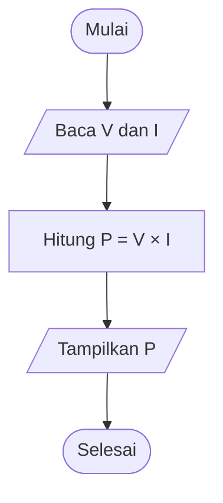
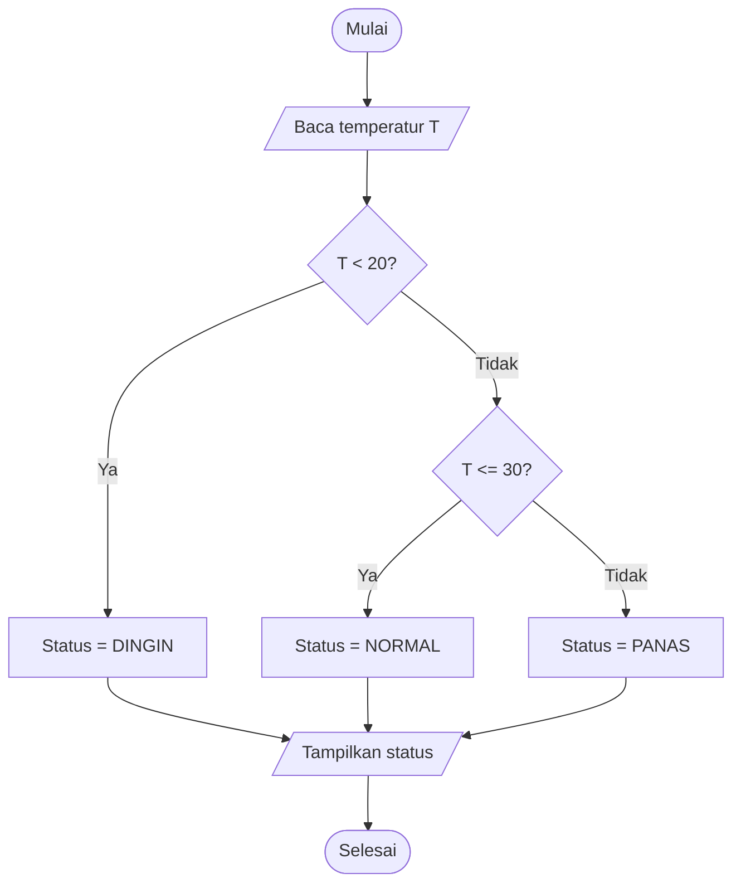
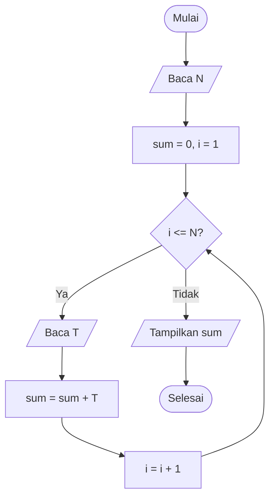
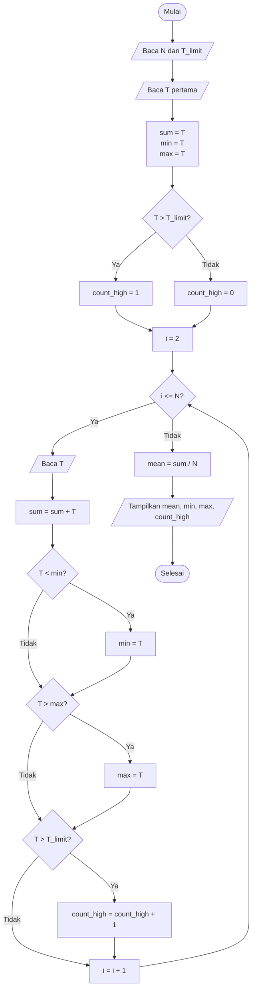

# Pertemuan 2: Berpikir Algoritmik dan Perancangan Algoritma

## Menyusun algoritma dari masalah fisika

Pada pertemuan sebelumnya kita telah melihat bahwa komputer bekerja dengan menjalankan instruksi yang sangat terstruktur. Komputer tidak memahami tujuan eksperimen, makna fisis suatu besaran, atau alasan kita menggunakan suatu persamaan. Komputer hanya "menuruti" manusia, menjalankan instruksi yang diberikan kepadanya. 

Dengan alasan di atas, sebelum menulis program, kita memerlukan suatu cara berpikir yang dapat menjembatani persoalan fisis dengan instruksi komputasi. Cara berpikir ini disebut **pola pikir algoritmik** (*algorithmic thinking*). Secara umum, alur yang akan sering kita gunakan sepanjang mata kuliah ini adalah
```math
\boxed{
\text{masalah}
\longrightarrow
\text{model}
\longrightarrow
\text{algoritma}
\longrightarrow
\text{program}
\longrightarrow
\text{hasil}
}
```

Pada pertemuan ini kita akan fokus pada bagian
```math
\boxed{
\text{masalah}
\longrightarrow
\text{model}
\longrightarrow
\text{algoritma}.
}
```
Bahasa pemrograman belum menjadi pusat perhatian. Kita memang akan melihat beberapa implementasi dalam bahasa C, tetapi tujuan utamanya adalah memahami bagaimana suatu persoalan dipecah menjadi langkah-langkah yang jelas sebelum diterjemahkan menjadi kode.

Sebagai contoh, misalkan kita memiliki $N$ data temperatur dari sebuah sensor,
```math
T_1,T_2,\ldots,T_N,
```
dan ingin memperoleh tiga informasi:
1. temperatur rata-rata;
2. temperatur minimum;
3. temperatur maksimum.

Secara matematis, temperatur rata-rata dapat ditulis sebagai
```math
\overline{T}
=
\frac{1}{N}
\sum_{i=1}^{N} T_i.
```
Akan tetapi, persamaan tersebut belum sepenuhnya menjelaskan kepada komputer bagaimana proses perhitungan harus dilakukan.

Komputer perlu mengetahui, misalnya:
- kapan proses dimulai;
- bagaimana setiap data dibaca;
- di mana jumlah sementara disimpan;
- bagaimana nilai minimum dan maksimum diperbarui;
- kapan proses berhenti;
- apa yang harus ditampilkan pada akhir proses.

Kita dapat menulis langkah awal secara informal sebagai berikut.
```text
Baca banyaknya data N
Baca temperatur pertama
Jadikan temperatur pertama sebagai nilai minimum dan maksimum sementara
Simpan temperatur pertama sebagai jumlah sementara

Untuk setiap temperatur berikutnya:
    tambahkan temperatur ke jumlah
    jika temperatur lebih kecil daripada minimum sementara,
        perbarui minimum
    jika temperatur lebih besar daripada maksimum sementara,
        perbarui maksimum

Hitung rata-rata = jumlah / N
Tampilkan rata-rata, minimum, dan maksimum
```

Langkah-langkah tersebut sudah jauh lebih dekat dengan sesuatu yang dapat diimplementasikan sebagai program. Di sinilah letak inti berpikir algoritmik. Kita perlu merunut:

> Informasi apa yang saya miliki, hasil apa yang saya inginkan, dan urutan proses apa yang membawa saya dari informasi awal menuju hasil tersebut?

Jadi, **jangan** langsung loncat ke
> Sintaks C apa yang harus saya tulis?

### Apa yang disebut algoritma?

Secara praktis, **algoritma** adalah urutan langkah yang terdefinisi dengan jelas untuk menyelesaikan suatu kelas persoalan. Sebuah algoritma yang baik biasanya memiliki beberapa sifat berikut:
- Memiliki **masukan** (*input*) yang jelas.
- Menghasilkan **keluaran** (*output*) yang jelas.
- Setiap langkah cukup jelas sehingga tidak menimbulkan banyak interpretasi.
- Langkah-langkahnya dapat dilaksanakan secara efektif.
- Prosesnya berhenti setelah sejumlah langkah yang berhingga untuk persoalan yang memang seharusnya selesai.
- Algoritma tidak hanya bekerja untuk satu angka tertentu, tetapi untuk suatu kelas data yang memenuhi asumsi yang ditetapkan.

Sebagai contoh, instruksi
```text
Hitung nilai temperatur yang baik
```
bukan merupakan langkah algoritmik yang memadai karena kata "baik" tidak memiliki definisi operasional. Sebaliknya,
```text
Jika temperatur berada pada rentang 20 hingga 30 derajat Celsius,
nyatakan status sebagai NORMAL.
```
lebih dekat dengan instruksi algoritmik karena kondisi keputusan telah dinyatakan secara eksplisit.

Demikian pula, instruksi
```text
Ulangi sampai hasilnya cukup dekat
```
masih belum lengkap jika kita tidak mendefinisikan apa yang dimaksud dengan "cukup dekat". Instruksi tersebut menjadi lebih jelas jika ditulis sebagai
```text
Ulangi selama galat absolut lebih besar daripada 0.001.
```
atau secara matematis
```math
|x_{\text{baru}}-x_{\text{lama}}| > 10^{-3}.
```
Berpikir algoritmik menuntut kita mengubah istilah yang masih samar menjadi aturan yang dapat diuji.

### Masukan, keluaran, dan spesifikasi

Sebelum merancang algoritma, akan sangat membantu jika kita menuliskan terlebih dahulu **spesifikasi masalah**. Spesifikasi sederhana sekurang-kurangnya memuat:
- masukan;
- keluaran;
- asumsi;
- aturan atau model yang digunakan.

Sebagai contoh, untuk perhitungan energi kinetik,
```math
E_k=\frac12mv^2,
```
kita dapat menulis spesifikasi sebagai berikut.

**Masukan:**
```math
m,\quad v.
```
**KeluaranL**
```math
E_k.
```
**Asumsi:**
```math
m\geq 0.
```
**Aturan perhitungan:**
```math
E_k=\frac12mv^2.
```

Dengan spesifikasi seperti di atas, kita dapat membedakan antara pertanyaan fisika dan pertanyaan komputasi. Pertanyaan fisikanya adalah:
> Model energi kinetik apa yang digunakan?

Pertanyaan komputasinya adalah:
> Bagaimana nilai $m$ dan $v$ diproses untuk menghasilkan $E_k$?

Pembedaan tersebut akan menjadi semakin penting ketika persoalan menjadi lebih besar.

### Prakondisi dan pascakondisi

Dalam pembahasan algoritma, dua istilah yang berguna adalah **prakondisi** (*precondition*) dan **pascakondisi** (*postcondition*).
Prakondisi menyatakan kondisi yang diasumsikan benar sebelum algoritma dimulai.
Pascakondisi menyatakan kondisi yang harus benar setelah algoritma selesai.

Sebagai contoh, algoritma untuk menghitung rata-rata dari $N$ data mempunyai prakondisi
```math
N>0.
```
Jika $N=0$, ekspresi
```math
\overline{x}
=
\frac{1}{N}\sum_{i=1}^{N}x_i
```
tidak dapat digunakan karena terjadi pembagian dengan nol. Pascakondisinya dapat dinyatakan sebagai
```math
\overline{x}
=
\frac{x_1+x_2+\cdots+x_N}{N}.
```

Konsep prakondisi dan pascakondisi membantu kita menjawab pertanyaan penting:

> Dalam kondisi apa algoritma ini dijamin menghasilkan keluaran yang benar?

## Dekomposisi masalah

Persoalan rekayasa yang riil hampir selalu terlalu besar untuk diselesaikan sebagai satu langkah tunggal. Salah satu strategi utama berpikir algoritmik adalah **dekomposisi**, yaitu memecah persoalan besar menjadi beberapa subproblem yang lebih kecil. 

Misalkan sebuah sistem akuisisi data temperatur menghasilkan berkas pengukuran. Kita ingin membuat program yang pada akhirnya dapat
- membaca data;
- memeriksa apakah data masuk akal;
- menghitung rata-rata;
- mencari minimum dan maksimum;
- menghitung banyak data yang melewati ambang batas;
- menyimpan hasil;
- membuat grafik.

Jika seluruh pekerjaan tersebut dipikirkan sekaligus, persoalannya terasa besar. Kita dapat memecahnya menjadi
```text
Masalah utama:
Analisis data temperatur

Submasalah:
1. Tentukan format data
2. Baca data
3. Validasi setiap data
4. Hitung statistik dasar
5. Identifikasi data di atas ambang
6. Simpan hasil
7. Visualisasikan hasil
```

Setiap submasalah masih dapat dipecah lagi. Sebagai contoh,
```text
Hitung besaran statistik dasar

dapat dipecah menjadi

- hitung jumlah
- hitung rata-rata
- cari minimum
- cari maksimum
```

Dekomposisi membantu kita memperoleh struktur detail dari masalah. Alih-alih memiliki satu program besar yang sulit dipahami, kita mulai melihat sekumpulan tugas kecil yang masing-masing mempunyai tujuan jelas.

### Pernyataan masalah menuju tujuan komputasi

Mari kita tinjau suatu persoalan fisika sederhana. Sebuah resistor dialiri arus $I$ dan memiliki hambatan $R$. Kita ingin menentukan daya yang didisipasikan.

Secara fisika,
```math
V=IR
```
dan
```math
P=VI.
```
Dengan mensubstitusikan $V=IR$, kita juga dapat menulis
```math
P=I^2R.
```

Sekarang kita perlu menentukan apa sebenarnya tujuan komputasinya. Jika masukan adalah $I$ dan $R$, maka salah satu algoritma paling langsung adalah
```text
Baca I
Baca R
Hitung P = I * I * R
Tampilkan P
```
Namun, jika kita juga membutuhkan tegangan, algoritmanya dapat ditulis
```text
Baca I
Baca R
Hitung V = I * R
Hitung P = V * I
Tampilkan V dan P
```
Kedua algoritma tersebut sah. Pemilihan algoritma bergantung pada informasi apa yang ingin kita peroleh dan bagaimana hasil perantara akan digunakan.

### Menentukan batasan masalah

Dekomposisi juga menuntut kita menentukan apa yang **tidak** sedang diselesaikan. Misalnya, untuk program daya resistor di atas, kita mungkin mengasumsikan
- hambatan tetap;
- resistor bersifat ohmik (mengikuti hukum Ohm);
- efek temperatur diabaikan;
- semua besaran diberikan dalam satuan SI.

Asumsi semacam ini penting karena program komputer selalu bekerja di dalam model tertentu. Program tidak secara otomatis mengetahui kapan suatu model fisika sudah tidak berlaku.

## Penulisan algoritma dengan kalimat berurutan

Bentuk paling awal dari algoritma dapat ditulis sebagai kalimat berurutan. Misalkan kita ingin menghitung posisi benda yang bergerak dengan percepatan konstan,
```math
x(t)
=
x_0+v_0t+\frac12at^2.
```
Masukan adalah
```math
x_0,\quad v_0,\quad a,\quad t.
```
Keluaran adalah

```math
x(t).
```

Algoritma dengan kalimat biasa dapat ditulis sebagai
```text
Baca posisi awal x0
Baca kecepatan awal v0
Baca percepatan a
Baca waktu t
Hitung posisi x = x0 + v0*t + 0.5*a*t*t
Tampilkan x
```

Untuk persoalan yang pendek, bentuk seperti ini sudah cukup baik. Keuntungan kalimat berurutan adalah mudah dibaca oleh orang yang belum terbiasa dengan notasi algoritmik. Kelemahannya, ketika persoalan menjadi lebih kompleks, kalimat biasa dapat menjadi panjang dan ambigu. Oleh karena itu, kita memerlukan representasi lain seperti diagram alir dan *pseudocode*.

## Diagram alir

**Diagram alir** (*flowchart*) merupakan representasi visual dari urutan proses dalam suatu algoritma. Beberapa simbol yang umum digunakan adalah
- oval untuk mulai dan selesai;
- jajar genjang untuk input dan output;
- persegi panjang untuk proses;
- belah ketupat untuk keputusan;
- panah untuk arah aliran proses.

### Diagram alir untuk perhitungan daya

Misalkan kita menggunakan
```math
P=VI.
```
Algoritmanya adalah
```text
Baca V
Baca I
Hitung P = V * I
Tampilkan P
```

Diagram alirnya dapat ditulis sebagai berikut.


Diagram tersebut hanya memiliki aliran lurus. Semua langkah dilaksanakan satu kali secara berurutan.

### Diagram alir dengan keputusan

Sekarang misalkan sensor temperatur digunakan untuk menentukan status sederhana:
- `DINGIN` jika $T<20^\circ\text{C}$;
- `NORMAL` jika $20^\circ\text{C}\leq T\leq30^\circ\text{C}$;
- `PANAS` jika $T>30^\circ\text{C}$.

Diagram alirnya dapat berupa


Pada tahap ini kita belum membahas sintaks `if` dalam C secara terperinci. Tujuannya adalah memahami bahwa beberapa algoritma memiliki **percabangan** karena program tidak selalu menjalankan jalur yang sama untuk semua masukan.

### Diagram alir dengan pengulangan

Misalkan kita ingin menjumlahkan $N$ data temperatur. Secara matematis,
```math
S
=
\sum_{i=1}^{N}T_i.
```
Secara algoritmik, komputer perlu melakukan penjumlahan berulang.


Diagram ini sudah memperlihatkan tiga pola dasar yang akan sering muncul dalam pemrograman:
- urutan,
- keputusan, dan
- pengulangan

Sebagian besar program dapat dipandang sebagai kombinasi ketiga pola tersebut.

## Pseudocode

Diagram alir sangat membantu untuk melihat struktur masalah, tetapi untuk algoritma yang lebih panjang nantinya diagram alir dapat menjadi terlalu besar. Representasi lain yang sangat penting dan bermanfaat adalah **pseudocode**.

*Pseudocode* merupakan cara menulis algoritma menggunakan bentuk yang menyerupai bahasa pemrograman, tetapi tidak terikat pada sintaksis bahasa tertentu. *Pseudocode* seharusnya cukup jelas untuk diterjemahkan ke C, Python, atau bahasa lain. 

*Pseudocode* tidak mempunyai satu standar yang universal karena yang lebih penting adalah konsistensi. Dalam catatan ini kita akan menggunakan beberapa konvensi berikut.

```text
INPUT    untuk masukan
OUTPUT   untuk keluaran
IF       untuk keputusan
ELSE     untuk alternatif
FOR      untuk pengulangan dengan pencacah
WHILE    untuk pengulangan berbasis kondisi
RETURN   untuk mengembalikan hasil
←        untuk pemberian nilai
```

Sebagai contoh,
```text
x ← 5
```
berarti
> simpan nilai 5 ke dalam variabel x.

Tanda panah digunakan agar tidak rancu dengan tanda sama dengan dalam matematika. Dalam matematika,
```math
x=5
```
menyatakan hubungan kesamaan. Di sisi lain, dalam algoritma,

```text
x ← x + 1
```
berarti nilai baru `x` diperoleh dari nilai lama `x` ditambah satu.

Ekspresi
```math
x=x+1
```
tidak mungkin benar sebagai persamaan matematika biasa, tetapi mempunyai makna yang jelas sebagai operasi pembaruan nilai dalam algoritma.

### Contoh pseudocode komputasi gerak lurus

Untuk
```math
x
=
x_0+v_0t+\frac12at^2,
```
*pseudocode* dapat ditulis sebagai
```text
ALGORITHM PositionConstantAcceleration

INPUT:
    x0
    v0
    a
    t

PROCESS:
    x ← x0 + v0*t + 0.5*a*t*t

OUTPUT:
    x
```

*Pseudocode* tersebut masih sangat dekat dengan persamaan matematis karena tidak terdapat keputusan atau pengulangan.

### Contoh pseudocode komputasi rata-rata data

Sekarang kita ingin menghitung rata-rata $N$ data,
```math
\overline{x}
=
\frac{1}{N}
\sum_{i=1}^{N}x_i.
```
*Pseudocode* dapat ditulis sebagai
```text
ALGORITHM Mean

INPUT:
    N
    x1, x2, ..., xN

PROCESS:
    sum ← 0

    FOR i ← 1 TO N
        sum ← sum + xi
    END FOR

    mean ← sum / N

OUTPUT:
    mean
```

Perhatikan bahwa formula jumlahan
```math
\sum_{i=1}^{N}x_i
```
diterjemahkan menjadi proses penambahan yang dilakukan satu per satu. Inilah salah satu contoh penting mengenai hubungan matematika dan algoritma. Notasi matematika sering kali menyatakan **apa** yang ingin dihitung. Algoritma harus menjelaskan **bagaimana** perhitungan tersebut dilakukan.

### Contoh pseudocode untuk rata-rata, minimum, dan maksimum

Kita dapat memperluas algoritma barusan.
```text
ALGORITHM Statistics

INPUT:
    N
    x1, x2, ..., xN

PRECONDITION:
    N > 0

PROCESS:
    sum ← x1
    minimum ← x1
    maximum ← x1

    FOR i ← 2 TO N
        sum ← sum + xi

        IF xi < minimum
            minimum ← xi
        END IF

        IF xi > maximum
            maximum ← xi
        END IF
    END FOR

    mean ← sum / N

OUTPUT:
    mean
    minimum
    maximum
```

Ada satu detail penting. Kita menginisialisasi
```text
minimum ← x1
maximum ← x1
```
bukan
```text
minimum ← 0
maximum ← 0
```

Mengapa? Anggap dulu semua data bernilai negatif,
```math
-5,\quad -2,\quad -8.
```
Jika `maximum` dimulai dari nol, algoritma akan menganggap maksimum tetap nol, padahal nol tidak pernah muncul dalam data. Dengan menginisialisasi minimum dan maksimum menggunakan data pertama, algoritma menjadi benar untuk data positif maupun negatif. Contoh ini menunjukkan bahwa detail kecil dalam perancangan algoritma dapat menentukan benar atau salahnya hasil.

## Menelusuri algoritma

Setelah menulis algoritma, kita belum boleh langsung menganggap algoritma tersebut benar. Salah satu teknik paling sederhana untuk memeriksa algoritma adalah penjejakan (**tracing**) atau *dry run*, yaitu eksekusi algoritma secara manual menggunakan data kecil.

Misalkan data temperatur adalah
```math
29.5,\quad30.2,\quad28.9,\quad31.1.
```
Kita ingin menelusuri algoritma statistik yang sudah dirumuskan sebelumnya.

Pada awal proses,

```math
\mathrm{sum}=29.5,
```

```math
\mathrm{minimum}=29.5,
```

dan

```math
\mathrm{maximum}=29.5.
```

Kemudian setiap data berikutnya diproses.

| Langkah | $x_i$ | `sum` | `minimum` | `maximum` |
|---:|---:|---:|---:|---:|
| awal | 29.5 | 29.5 | 29.5 | 29.5 |
| 2 | 30.2 | 59.7 | 29.5 | 30.2 |
| 3 | 28.9 | 88.6 | 28.9 | 30.2 |
| 4 | 31.1 | 119.7 | 28.9 | 31.1 |

Setelah seluruh data selesai diproses,
```math
\overline{T}
=
\frac{119.7}{4}
=
29.925.
```
Jadi, hasil akhirnya adalah
```math
\overline{T}=29.925,
```
```math
T_{\min}=28.9,
```
dan

```math
T_{\max}=31.1.
```
*Tracing* sangat berguna karena memungkinkan kita melihat perubahan nilai variabel dari satu langkah ke langkah berikutnya.

### Keadaan algoritma

Pada saat algoritma sedang berjalan, variabel-variabel di dalamnya mempunyai nilai tertentu. Kumpulan nilai tersebut dapat disebut **keadaan** (*state*) algoritma.

Sebagai contoh, setelah data ketiga pada tabel sebelumnya diproses, keadaan algoritma adalah
```text
i       = 3
sum     = 88.6
minimum = 28.9
maximum = 30.2
```

Ketika kita mempelajari pengulangan dalam C, kebiasaan melacak keadaan seperti ini sangat membantu. Banyak kesalahan dalam program berasal dari ketidaktepatan memperbarui keadaan.

### Konsep invarian

Ada satu cara berpikir yang sangat berguna ketika memeriksa algoritma berulang. Setelah setiap iterasi, kita dapat bertanya:
> Apa yang harus selalu benar sejauh ini?

Untuk algoritma penjumlahan, setelah $i$ data diproses,
```math
\text{sum}
=
\sum_{k=1}^{i}x_k.
```
Untuk algoritma minimum,
```math
\text{minimum}
=
\min(x_1,x_2,\ldots,x_i).
```
Untuk algoritma maksimum,
```math
\text{maximum}
=
\max(x_1,x_2,\ldots,x_i).
```

Pernyataan yang tetap benar selama pengulangan semacam ini disebut **invarian**. Pada mata kuliah ini kita tidak akan melakukan pembuktian formal yang berat, tetapi konsep invarian membantu kita memahami mengapa suatu algoritma bekerja.

## Memeriksa kebenaran algoritma

Sebuah algoritma dikatakan benar jika, untuk setiap masukan yang memenuhi prakondisinya, algoritma menghasilkan keluaran yang memenuhi spesifikasi. Dalam praktik mata kuliah ini kita akan menggunakan pendekatan yang lebih sederhana tetapi masih tetap sistematis.

Kita akan memeriksa algoritma melalui
- penelusuran manual;
- kasus sederhana;
- kasus batas;
- perbandingan dengan hasil yang sudah diketahui;
- pemeriksaan satuan dan orde besaran;
- penalaran terhadap setiap langkah.

### Kasus biasa dan kasus batas

Misalkan algoritma menghitung rata-rata $N$ data. Kasus biasa mungkin menggunakan
```math
N=5.
```
Namun, kita juga perlu memikirkan kasus batas seperti
```math
N=1
```
dan
```math
N=0.
```

Jika
```math
N=1,
```
rata-rata seharusnya sama dengan satu-satunya data.
Jika

```math
N=0,
```
algoritma harus menolak masukan atau menangani kondisi tersebut karena pembagian dengan nol tidak diperbolehkan. Kasus batas sering mengungkap kesalahan yang tidak terlihat pada data biasa.

### Contoh kesalahan pada pencarian maksimum

Misalkan kita menulis
```text
maximum ← 0

FOR setiap x
    IF x > maximum
        maximum ← x
    END IF
END FOR
```
Untuk data
```math
5,\quad2,\quad7,
```
algoritma tampak bekerja. Namun, untuk data
```math
-5,\quad-2,\quad-7,
```
hasilnya salah karena `maximum` tetap nol. Masalahnya bukan pada sintaks, melainkan pada rancangan algoritma.

Perbaikan yang diperlukan adalah
```text
maximum ← x1

FOR i ← 2 TO N
    IF xi > maximum
        maximum ← xi
    END IF
END FOR
```

### Pemeriksaan berdasarkan fisika

Dalam persoalan teknik, kebenaran algoritma tidak hanya diperiksa dari sisi struktur komputasi. Kita juga perlu menggunakan pengetahuan fisika. Misalkan algoritma menghitung energi kinetik. Jika
```math
m=2\text{ kg}
```
dan
```math
v=3\text{ m/s},
```
maka
```math
E_k=9\text{ J}.
```

Jika program menghasilkan
```math
E_k=-9\text{ J},
```
kita langsung mengetahui ada masalah karena energi kinetik pada fisika klasik tidak bisa negatif. Jika program menghasilkan
```math
E_k=9\times10^{9}\text{ J},
```
kita juga harus curiga terhadap satuan atau kesalahan perhitungan. Dengan demikian, pemeriksaan algoritma dalam Teknik Fisika sebaiknya menggunakan dua lapisan:

```text
Apakah langkah komputasinya benar?
Apakah hasilnya masuk akal secara fisika?
```

## Implementasi algoritma dalam bahasa tertentu

Setelah algoritma cukup jelas, kita dapat mulai menerjemahkannya ke bahasa pemrograman. Pada pertemuan ini bahasa C masih digunakan sebagai ilustrasi. Kita belum akan membahas semua sintaks secara sistematis.

### Algoritma berurutan dalam C

Tinjau kembali persamaan gerak
```math
x
=
x_0+v_0t+\frac12at^2.
```
*Pseudocode*-nya adalah
```text
INPUT x0, v0, a, t
x ← x0 + v0*t + 0.5*a*t*t
OUTPUT x
```
Salah satu implementasi C adalah
```c
#include <stdio.h>

int main(void)
{
    double x0 = 2.0;
    double v0 = 5.0;
    double a = 3.0;
    double t = 4.0;

    double x = x0 + v0 * t + 0.5 * a * t * t;

    printf("x = %.3f m\n", x);

    return 0;
}
```

Perhatikan bahwa struktur program mengikuti struktur algoritma.
```text
nilai awal
    ↓
perhitungan
    ↓
keluaran
```
Kita dapat mengganti nilai $x_0$, $v_0$, $a$, dan $t$ tanpa mengubah ide algoritmanya.

### Algoritma keputusan dalam C

Tinjau klasifikasi temperatur:
```text
IF T < 20
    status ← DINGIN
ELSE IF T <= 30
    status ← NORMAL
ELSE
    status ← PANAS
END IF
```
Implementasi C dapat dibuat semacam di bawah ini.
```c
#include <stdio.h>

int main(void)
{
    double temperature = 32.5;

    if (temperature < 20.0)
    {
        printf("DINGIN\n");
    }
    else if (temperature <= 30.0)
    {
        printf("NORMAL\n");
    }
    else
    {
        printf("PANAS\n");
    }

    return 0;
}
```
Sintaks `if`, `else if`, dan `else` akan dibahas lebih terperinci pada pertemuan mendatang.

Pada tahap ini perhatikan korespondensinya:
```text
keputusan dalam algoritma
        ↓
percabangan dalam program
```

### Algoritma pengulangan dalam C

Sekarang kita melihat pratinjau implementasi algoritma rata-rata.

```c
#include <stdio.h>

int main(void)
{
    int n = 4;
    double sum = 0.0;

    double t1 = 29.5;
    double t2 = 30.2;
    double t3 = 28.9;
    double t4 = 31.1;

    sum = t1 + t2 + t3 + t4;

    double mean = sum / n;

    printf("Mean temperature = %.3f C\n", mean);

    return 0;
}
```

Program ini bekerja, tetapi tidak fleksibel karena kita menulis setiap data secara terpisah.

Untuk data dalam jumlah besar kita memerlukan pengulangan.

Sebagai gambaran awal, C menyediakan struktur seperti

```c
for (int i = 0; i < n; i++)
{
    /* lakukan proses berulang */
}
```

Pada pertemuan tentang pengulangan nanti kita akan mempelajari struktur tersebut secara rinci.

Untuk sekarang, hal yang penting adalah memahami ide

```text
FOR setiap data
    lakukan proses
END FOR
```

yang kemudian diterjemahkan menjadi bentuk pengulangan dalam C.

### Hubungan pseudocode dan C

Secara kasar, beberapa konstruksi pseudocode mempunyai pasangan dalam C.

| Pseudocode | Gagasan dalam C |
|---|---|
| `x ← 5` | `x = 5;` |
| `IF kondisi` | `if (kondisi)` |
| `ELSE` | `else` |
| `FOR ...` | `for (...)` |
| `WHILE kondisi` | `while (kondisi)` |
| `OUTPUT x` | misalnya `printf(...)` |

Tabel tersebut bukan aturan penerjemahan otomatis.

Tujuannya hanya menunjukkan bahwa pseudocode berada satu tingkat di atas bahasa pemrograman.

Kita merancang logika terlebih dahulu, baru memilih sintaks.

## Efisiensi algoritma

Dua algoritma dapat menghasilkan jawaban yang sama, tetapi memerlukan jumlah pekerjaan yang berbeda.

Karena itu selain bertanya

> Apakah algoritma ini benar?

kita juga perlu mulai bertanya

> Berapa banyak pekerjaan yang diperlukan algoritma ini ketika ukuran data membesar?

Pertanyaan tersebut membawa kita pada **kompleksitas algoritma**.

Pada pertemuan ini kita hanya membahas kompleksitas secara intuitif.

Pembahasan lebih rinci akan muncul kembali ketika kita mempelajari algoritma pencarian dan pengurutan.

### Ukuran masukan

Untuk menganalisis efisiensi, kita perlu mendefinisikan ukuran masukan.

Misalnya, jika kita memproses $N$ data temperatur, maka ukuran masukannya dapat dianggap sebagai

```math
N.
```

Jika kita mempunyai citra dengan ukuran

```math
M\times N,
```

jumlah pikselnya adalah

```math
MN.
```

Jika algoritma bekerja pada matriks bujur sangkar berukuran

```math
N\times N,
```

ukuran masalah sering dinyatakan dengan $N$.

### Operasi konstan: $O(1)$

Pertimbangkan perhitungan energi kinetik

```math
E_k=\frac12mv^2.
```

Berapa pun nilai $m$ dan $v$, jumlah operasi aritmetika yang dilakukan tetap.

Kita tidak melakukan semakin banyak operasi hanya karena nilai massanya besar.

Algoritma semacam ini dikatakan mempunyai kompleksitas waktu konstan,

```math
O(1).
```

Notasi tersebut tidak berarti algoritma hanya melakukan satu operasi.

Maknanya adalah jumlah operasi tidak bertambah sebagai fungsi ukuran masukan.

### Proses satu kali untuk setiap data: $O(N)$

Untuk menghitung jumlah

```math
S
=
\sum_{i=1}^{N}x_i,
```

kita harus mengunjungi setiap data.

Jika $N$ menjadi dua kali lebih besar, secara kasar pekerjaan juga menjadi dua kali lebih besar.

Algoritmanya

```text
sum ← 0

FOR i ← 1 TO N
    sum ← sum + xi
END FOR
```

mempunyai kompleksitas waktu

```math
O(N).
```

Jumlah operasi penjumlahan kira-kira sebanding dengan $N$.

### Dua pengulangan bersarang: $O(N^2)$

Misalkan kita memiliki $N$ sensor dan ingin membandingkan setiap sensor dengan setiap sensor lainnya.

Pseudocode sederhana dapat berbentuk

```text
FOR i ← 1 TO N
    FOR j ← 1 TO N
        bandingkan sensor i dengan sensor j
    END FOR
END FOR
```

Pengulangan luar dilakukan sekitar $N$ kali.

Untuk setiap iterasi pengulangan luar, pengulangan dalam juga dilakukan sekitar $N$ kali.

Jumlah operasi menjadi kira-kira

```math
N\times N
=
N^2.
```

Kompleksitasnya ditulis

```math
O(N^2).
```

Jika

```math
N=100,
```

maka jumlah pasangan yang diproses berada pada orde

```math
10^4.
```

Jika

```math
N=1000,
```

jumlahnya berada pada orde

```math
10^6.
```

Pertumbuhan kuadratik menjadi penting ketika data semakin besar.

### Mengapa konstanta sering diabaikan?

Misalkan algoritma A memerlukan kira-kira

```math
3N+5
```

operasi.

Algoritma B memerlukan kira-kira

```math
100N+20
```

operasi.

Keduanya tetap bertumbuh secara linear terhadap $N$.

Dalam notasi orde besar, keduanya ditulis sebagai

```math
O(N).
```

Notasi Big-O terutama digunakan untuk melihat pola pertumbuhan saat ukuran masalah membesar.

Konstanta tetap penting dalam performa nyata, tetapi pada tahap analisis awal kita lebih tertarik pada perbedaan antara pertumbuhan seperti

```math
O(1),
```

```math
O(N),
```

dan

```math
O(N^2).
```

### Perbandingan pertumbuhan

Perhatikan tabel berikut.

| $N$ | $N$ | $N^2$ |
|---:|---:|---:|
| 10 | 10 | 100 |
| 100 | 100 | 10,000 |
| 1,000 | 1,000 | 1,000,000 |
| 10,000 | 10,000 | 100,000,000 |

Perbedaan antara $O(N)$ dan $O(N^2)$ mungkin tampak tidak penting untuk $N$ kecil, tetapi menjadi sangat besar ketika $N$ bertambah.

### Kompleksitas bukan waktu dalam detik

Penting untuk membedakan **kompleksitas algoritma** dan **waktu eksekusi aktual**.

Waktu eksekusi dalam detik bergantung pada

- kecepatan prosesor;
- compiler;
- bahasa pemrograman;
- sistem operasi;
- kondisi perangkat keras;
- implementasi program.

Sebaliknya, kompleksitas mencoba menggambarkan bagaimana kebutuhan komputasi **bertumbuh** terhadap ukuran masalah.

Karena itu

```math
O(N)
```

bukan berarti program memerlukan $N$ detik.

### Kompleksitas ruang

Selain waktu, algoritma juga menggunakan memori.

Kita dapat membedakan

- kompleksitas waktu;
- kompleksitas ruang.

Misalkan kita hanya menyimpan

```text
sum
minimum
maximum
```

ketika membaca data satu per satu.

Jumlah memori tambahan yang digunakan tidak bergantung pada $N$.

Secara intuitif, kebutuhan memorinya bersifat

```math
O(1).
```

Sebaliknya, jika kita menyimpan seluruh $N$ data dalam sebuah larik, memori yang dibutuhkan bertambah sebanding dengan $N$,

```math
O(N).
```

Kita akan membahas pertukaran antara penyimpanan data dan pemrosesan ketika mempelajari larik serta pengolahan berkas.

## Studi kasus: monitoring temperatur

Sekarang kita gabungkan beberapa gagasan dalam satu contoh.

Sebuah sensor mengukur temperatur suatu sistem termal sebanyak $N$ kali.

Kita ingin memperoleh

- temperatur rata-rata;
- temperatur minimum;
- temperatur maksimum;
- banyak pengukuran yang melebihi ambang $T_{\text{limit}}$.

Sebagai contoh, misalkan

```math
T_{\text{limit}}
=
30^\circ\text{C}.
```

### Spesifikasi masalah

**Masukan**

```math
N,
```

```math
T_1,T_2,\ldots,T_N,
```

dan

```math
T_{\text{limit}}.
```

**Prakondisi**

```math
N>0.
```

**Keluaran**

```math
\overline{T},
```

```math
T_{\min},
```

```math
T_{\max},
```

dan banyak pengukuran yang memenuhi

```math
T_i>T_{\text{limit}}.
```

### Dekomposisi

Persoalan tersebut dapat dipecah menjadi

```text
1. Baca N
2. Baca batas temperatur
3. Inisialisasi statistik
4. Baca setiap temperatur
5. Perbarui jumlah
6. Perbarui minimum
7. Perbarui maksimum
8. Hitung banyak data di atas batas
9. Hitung rata-rata
10. Tampilkan hasil
```

### Pseudocode

```text
ALGORITHM TemperatureMonitoring

INPUT:
    N
    T_limit
    T1, T2, ..., TN

PRECONDITION:
    N > 0

PROCESS:
    sum ← T1
    minimum ← T1
    maximum ← T1

    IF T1 > T_limit
        count_high ← 1
    ELSE
        count_high ← 0
    END IF

    FOR i ← 2 TO N
        sum ← sum + Ti

        IF Ti < minimum
            minimum ← Ti
        END IF

        IF Ti > maximum
            maximum ← Ti
        END IF

        IF Ti > T_limit
            count_high ← count_high + 1
        END IF
    END FOR

    mean ← sum / N

OUTPUT:
    mean
    minimum
    maximum
    count_high
```

### Diagram alir



### Tracing

Gunakan data

```math
N=5,
```

```math
T_{\text{limit}}=30.0,
```

dan

```math
T=
\{29.5,\ 30.2,\ 28.9,\ 31.1,\ 30.0\}.
```

Hasil tracing adalah

| $i$ | $T_i$ | `sum` | `minimum` | `maximum` | `count_high` |
|---:|---:|---:|---:|---:|---:|
| 1 | 29.5 | 29.5 | 29.5 | 29.5 | 0 |
| 2 | 30.2 | 59.7 | 29.5 | 30.2 | 1 |
| 3 | 28.9 | 88.6 | 28.9 | 30.2 | 1 |
| 4 | 31.1 | 119.7 | 28.9 | 31.1 | 2 |
| 5 | 30.0 | 149.7 | 28.9 | 31.1 | 2 |

Rata-ratanya adalah

```math
\overline{T}
=
\frac{149.7}{5}
=
29.94.
```

Jadi

```math
\boxed{
\overline{T}=29.94^\circ\text{C}
}
```

```math
\boxed{
T_{\min}=28.9^\circ\text{C}
}
```

```math
\boxed{
T_{\max}=31.1^\circ\text{C}
}
```

dan terdapat dua data yang memenuhi

```math
T_i>30.0^\circ\text{C}.
```

### Kompleksitas

Setiap temperatur diproses satu kali.

Jika jumlah data menjadi dua kali lebih besar, jumlah pekerjaan secara kasar juga menjadi dua kali lebih besar.

Karena itu kompleksitas waktunya adalah

```math
O(N).
```

Algoritma hanya memerlukan beberapa variabel tambahan,

```text
sum
minimum
maximum
count_high
```

sehingga jika data dibaca satu per satu tanpa disimpan semuanya, kebutuhan memori tambahannya adalah

```math
O(1).
```

### Pratinjau implementasi dalam C

Implementasi berikut diperlihatkan sebagai gambaran hubungan pseudocode dengan program C.

Sintaks `for`, `if`, dan `scanf` akan dibahas secara lebih sistematis pada pertemuan berikutnya.

```c
#include <stdio.h>

int main(void)
{
    int n;
    double limit;

    printf("Number of measurements: ");
    scanf("%d", &n);

    printf("Temperature limit: ");
    scanf("%lf", &limit);

    if (n <= 0)
    {
        printf("Number of measurements must be positive.\n");
        return 1;
    }

    double temperature;

    printf("T1: ");
    scanf("%lf", &temperature);

    double sum = temperature;
    double minimum = temperature;
    double maximum = temperature;

    int count_high = 0;

    if (temperature > limit)
    {
        count_high = 1;
    }

    for (int i = 2; i <= n; i++)
    {
        printf("T%d: ", i);
        scanf("%lf", &temperature);

        sum = sum + temperature;

        if (temperature < minimum)
        {
            minimum = temperature;
        }

        if (temperature > maximum)
        {
            maximum = temperature;
        }

        if (temperature > limit)
        {
            count_high = count_high + 1;
        }
    }

    double mean = sum / n;

    printf("\nMean        = %.3f C\n", mean);
    printf("Minimum     = %.3f C\n", minimum);
    printf("Maximum     = %.3f C\n", maximum);
    printf("Above limit = %d\n", count_high);

    return 0;
}
```

Perhatikan struktur program tersebut.

Bagian

```c
double sum = temperature;
double minimum = temperature;
double maximum = temperature;
```

merepresentasikan tahap inisialisasi.

Bagian

```c
for (int i = 2; i <= n; i++)
```

merepresentasikan pengulangan.

Bagian

```c
if (temperature < minimum)
```

dan

```c
if (temperature > maximum)
```

merepresentasikan keputusan.

Program tersebut pada dasarnya hanyalah pseudocode yang telah diterjemahkan ke sintaks C.

## Kesalahan umum dalam merancang algoritma

Kesalahan algoritmik sering muncul bahkan sebelum kita menulis satu baris kode.

Beberapa pola kesalahan berikut perlu dikenali sejak awal.

### Langkah tidak cukup jelas

Instruksi

```text
Perbaiki nilai jika diperlukan
```

tidak cukup jelas.

Kapan perbaikan diperlukan?

Bagaimana cara memperbaikinya?

Apa kriterianya?

Algoritma harus mengubah kata-kata semacam itu menjadi kondisi yang dapat diuji.

### Tidak menetapkan nilai awal

Misalkan kita menulis

```text
FOR setiap x
    sum ← sum + x
END FOR
```

tetapi tidak pernah memberi nilai awal kepada `sum`.

Kita belum mengetahui apa nilai `sum` sebelum data pertama diproses.

Untuk penjumlahan, nilai awal yang sesuai adalah

```text
sum ← 0.
```

### Batas pengulangan salah

Misalkan data memiliki indeks

```math
1,2,\ldots,N.
```

Jika pengulangan berhenti pada

```math
N-1,
```

data terakhir tidak diproses.

Jika pengulangan berjalan sampai

```math
N+1,
```

algoritma mencoba mengakses data yang tidak ada.

Kesalahan seperti ini sering disebut **off-by-one error**.

### Kondisi berhenti tidak pernah tercapai

Misalkan kita menulis

```text
WHILE error > tolerance
    lakukan perhitungan
END WHILE
```

tetapi nilai `error` tidak pernah diperbarui.

Algoritma dapat berjalan tanpa akhir.

Setiap pengulangan harus memiliki mekanisme yang membuat kondisi berhenti dapat tercapai, kecuali pengulangan tanpa akhir memang sengaja dirancang.

### Asumsi yang tidak dinyatakan

Algoritma pencarian tertentu mungkin hanya bekerja jika data sudah terurut.

Algoritma lain mungkin mengasumsikan

```math
N>0.
```

Jika asumsi semacam ini tidak ditulis, pengguna algoritma dapat memberinya masukan yang tidak sesuai.

## Kebiasaan berpikir sebelum menulis program

Sebelum mulai menulis C, biasakan menjawab pertanyaan berikut.

**Apa persoalannya?**

Nyatakan dalam satu atau dua kalimat.

**Apa masukannya?**

Tuliskan variabel dan satuannya jika relevan.

**Apa keluarannya?**

Nyatakan dengan jelas hasil yang diinginkan.

**Model atau persamaan apa yang digunakan?**

Pisahkan model fisika dari implementasi program.

**Apakah ada asumsi atau batasan?**

Contohnya

```math
N>0,
```

atau

```math
m\geq0.
```

**Bisakah masalah dipecah menjadi submasalah?**

Lakukan dekomposisi.

**Apakah diperlukan keputusan?**

Jika ya, tentukan kondisi secara eksplisit.

**Apakah diperlukan pengulangan?**

Jika ya, tentukan apa yang berubah setiap iterasi dan kapan proses berhenti.

**Bagaimana memeriksa hasilnya?**

Siapkan setidaknya satu kasus yang dapat dihitung secara manual.

**Seberapa besar pekerjaan komputasinya?**

Apakah kira-kira

```math
O(1),
```

```math
O(N),
```

atau

```math
O(N^2)?
```

Kebiasaan menjawab pertanyaan-pertanyaan tersebut akan mengurangi kecenderungan menulis kode melalui percobaan acak.

## Beberapa pertanyaan untuk diperiksa sendiri

Cobalah menjawab beberapa pertanyaan berikut tanpa melihat kembali catatan.

- Apa perbedaan antara masalah, model, algoritma, dan program?
- Mengapa persamaan matematika belum selalu cukup untuk menjadi algoritma?
- Apa yang dimaksud dengan dekomposisi masalah?
- Apa fungsi prakondisi dan pascakondisi?
- Apa tiga pola dasar aliran kontrol yang muncul dalam diagram alir?
- Mengapa pseudocode tidak seharusnya terlalu terikat pada satu bahasa pemrograman?
- Apa perbedaan antara tanda `=` dalam matematika dan operasi pemberian nilai dalam algoritma?
- Mengapa `maximum ← 0` dapat menghasilkan kesalahan untuk sekumpulan data negatif?
- Apa tujuan melakukan tracing?
- Apa yang dimaksud dengan keadaan (*state*) algoritma?
- Secara intuitif, apa yang dimaksud dengan invarian?
- Apa yang dimaksud dengan kasus batas?
- Mengapa algoritma yang benar masih perlu diuji menggunakan pengetahuan fisika?
- Apa arti kompleksitas $O(1)$?
- Apa arti kompleksitas $O(N)$?
- Mengapa dua pengulangan bersarang sering menghasilkan kompleksitas $O(N^2)$?
- Mengapa Big-O tidak sama dengan waktu dalam detik?
- Apa perbedaan kompleksitas waktu dan kompleksitas ruang?

## Latihan

### 1. Perumusan algoritma dari suatu masalah fisika

Sebuah sensor tekanan menghasilkan satu nilai tekanan $P$ dalam satuan pascal.

Tuliskan spesifikasi masalah untuk mengubah tekanan tersebut menjadi kilopascal menggunakan

```math
P_{\text{kPa}}
=
\frac{P_{\text{Pa}}}{1000}.
```

Tentukan

- masukan;
- keluaran;
- langkah algoritma;
- prakondisi yang masuk akal.

Tuliskan algoritma dengan kalimat berurutan.

### 2. Diagram alir

Buat diagram alir untuk menghitung daya listrik menggunakan

```math
P=VI.
```

Masukan adalah $V$ dan $I$.

Keluaran adalah $P$.

Kemudian perluas diagram tersebut sehingga program juga menampilkan peringatan jika

```math
P>100\text{ W}.
```

### 3. Pseudocode gerak lurus

Sebuah benda bergerak dengan persamaan

```math
x(t)
=
x_0+v_0t+\frac12at^2.
```

Tuliskan pseudocode untuk menghitung

- posisi $x(t)$;
- kecepatan

```math
v(t)=v_0+at.
```

Masukan adalah

```math
x_0,\quad v_0,\quad a,\quad t.
```

### 4. Tracing

Gunakan algoritma statistik berikut.

```text
sum ← x1
minimum ← x1
maximum ← x1

FOR i ← 2 TO N
    sum ← sum + xi

    IF xi < minimum
        minimum ← xi
    END IF

    IF xi > maximum
        maximum ← xi
    END IF
END FOR
```

Lakukan tracing untuk data

```math
4.2,\quad3.8,\quad5.1,\quad2.9,\quad4.7.
```

Buat tabel yang memuat

- indeks;
- data;
- `sum`;
- `minimum`;
- `maximum`.

### 5. Mencari kesalahan algoritma

Perhatikan algoritma berikut.

```text
minimum ← 0

FOR i ← 1 TO N
    IF xi < minimum
        minimum ← xi
    END IF
END FOR
```

Apakah algoritma tersebut selalu benar?

Uji menggunakan data

```math
2,\quad5,\quad1,\quad4.
```

Kemudian uji menggunakan

```math
2,\quad5,\quad1,\quad4,\quad8.
```

Jelaskan mengapa hasil tertentu dapat menipu kita seolah-olah algoritma sudah benar.

Perbaiki algoritma tersebut.

### 6. Kompleksitas

Tentukan kompleksitas waktu secara intuitif untuk algoritma berikut.

**Algoritma A**

```text
y ← a*x + b
```

**Algoritma B**

```text
sum ← 0

FOR i ← 1 TO N
    sum ← sum + xi
END FOR
```

**Algoritma C**

```text
FOR i ← 1 TO N
    FOR j ← 1 TO N
        print(i, j)
    END FOR
END FOR
```

Pilih dari

```math
O(1),
```

```math
O(N),
```

atau

```math
O(N^2).
```

Jelaskan alasan setiap jawaban.

### 7. Perbandingan pertumbuhan

Hitung nilai $N$ dan $N^2$ untuk

```math
N=10,
```

```math
N=100,
```

```math
N=1000,
```

dan

```math
N=10000.
```

Jelaskan mengapa algoritma $O(N^2)$ dapat menjadi masalah untuk data besar.

### 8. Studi kasus temperatur

Gunakan data

```math
T=
\{27.5,\ 31.2,\ 29.0,\ 32.8,\ 30.1,\ 28.4\}
```

dengan batas

```math
T_{\text{limit}}
=
30^\circ\text{C}.
```

Secara manual tentukan

- rata-rata;
- minimum;
- maksimum;
- banyak data yang lebih besar daripada batas.

Kemudian lakukan tracing algoritma `TemperatureMonitoring`.

### 9. Implementasi C sederhana

Buat program C berdasarkan pseudocode berikut.

```text
INPUT:
    voltage
    current

power ← voltage * current

OUTPUT:
    power
```

Gunakan

```math
V=12.0\text{ V}
```

dan

```math
I=2.5\text{ A}.
```

Prediksi hasil secara manual sebelum menjalankan program.

### 10. Tantangan: dari pseudocode ke C

Gunakan pseudocode berikut.

```text
INPUT:
    N

sum ← 0

FOR i ← 1 TO N
    INPUT x
    sum ← sum + x
END FOR

mean ← sum / N

OUTPUT mean
```

Cobalah menulis implementasinya dalam C meskipun struktur `for` belum dibahas secara formal.

Gunakan data sederhana dan bandingkan hasil program dengan perhitungan manual.

## Rangkuman

- Berpikir algoritmik merupakan proses mengubah persoalan menjadi langkah-langkah komputasi yang jelas dan dapat dilaksanakan.

- Alur yang digunakan sepanjang mata kuliah ini adalah

```math
\boxed{
\text{masalah}
\longrightarrow
\text{model}
\longrightarrow
\text{algoritma}
\longrightarrow
\text{program}
\longrightarrow
\text{hasil}.
}
```

- Sebelum menulis program, kita sebaiknya menentukan masukan, keluaran, asumsi, prakondisi, dan hasil yang diharapkan.

- Persoalan besar dapat dipecah menjadi subpersoalan yang lebih kecil melalui dekomposisi.

- Algoritma dapat direpresentasikan menggunakan kalimat berurutan, diagram alir, dan pseudocode.

- Tiga pola aliran kontrol yang penting adalah

```text
urutan
keputusan
pengulangan
```

- Pseudocode digunakan untuk merancang logika tanpa terlalu terikat pada sintaks bahasa tertentu.

- Tracing membantu memeriksa perubahan keadaan algoritma dari satu langkah ke langkah berikutnya.

- Kebenaran algoritma diperiksa melalui penelusuran, kasus sederhana, kasus batas, hasil yang telah diketahui, serta pemeriksaan makna fisik.

- Kompleksitas algoritma memberikan gambaran mengenai bagaimana kebutuhan komputasi bertumbuh terhadap ukuran masukan.

- Pada tahap awal kita mengenal tiga pola pertumbuhan penting:

```math
O(1),
```

```math
O(N),
```

dan

```math
O(N^2).
```

- Kompleksitas tidak menyatakan waktu dalam detik. Kompleksitas menyatakan pola pertumbuhan pekerjaan komputasi ketika ukuran masalah membesar.

- Contoh monitoring temperatur memperlihatkan bahwa satu algoritma dapat memadukan pengulangan, keputusan, statistik sederhana, tracing, pemeriksaan kebenaran, serta analisis kompleksitas.

- Setelah algoritma cukup jelas, langkah berikutnya adalah menerjemahkan algoritma ke bahasa pemrograman. Pada pertemuan selanjutnya kita akan mulai mempelajari struktur dasar program C, tipe data, variabel, operator, ekspresi, logika Boolean, serta input dan output secara lebih sistematis.
