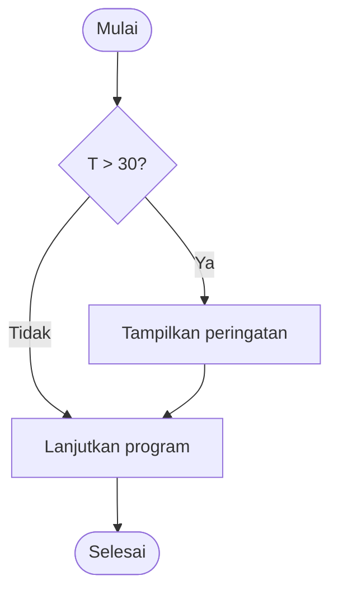
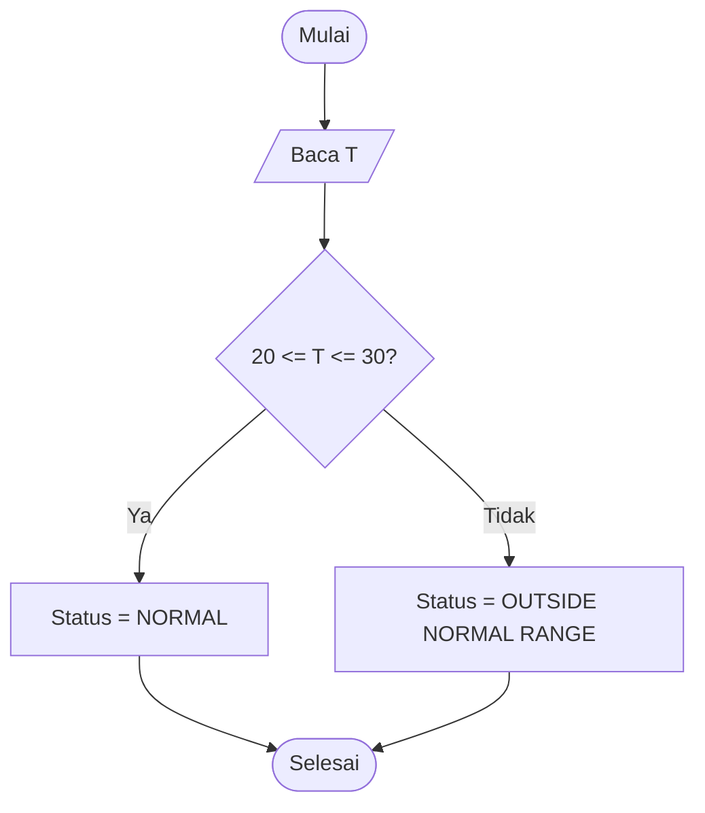
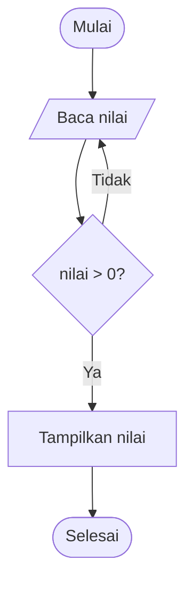

# Kuliah 4: Percabangan dan Pengulangan

## Aliran kontrol dalam program

Pada kuliah sebelumnya kita telah mempelajari bagaimana algoritma diterjemahkan menjadi program C menggunakan variabel, tipe data, ekspresi, operator relasional, operator logika, serta input dan output.

Program-program tersebut sebagian besar masih berjalan secara berurutan:

```text
masukan
    ↓
proses
    ↓
keluaran
```

Namun, banyak persoalan rekayasa tidak dapat diselesaikan hanya dengan urutan lurus.

Program sering perlu mengambil keputusan.

Sebagai contoh:

- jika temperatur terlalu tinggi, aktifkan peringatan;
- jika tekanan berada di luar rentang aman, tampilkan alarm;
- jika input tidak valid, minta pengguna memasukkan nilai kembali.

Program juga sering perlu mengulangi proses.

Sebagai contoh:

- membaca 100 data sensor;
- menghitung posisi benda untuk beberapa nilai waktu;
- mengulangi pengukuran sampai kondisi tertentu tercapai;
- menghitung jumlah, rata-rata, minimum, dan maksimum dari sekumpulan data.

Dua kemampuan tersebut disebut **percabangan** (*branching*) dan **pengulangan** (*looping* atau *iteration*).

Secara konseptual, program dapat dibangun dari tiga pola dasar:

```text
urutan
percabangan
pengulangan
```

Ketiganya merupakan fondasi utama aliran kontrol dalam pemrograman terstruktur.

## Percabangan

Percabangan memungkinkan program memilih jalur eksekusi berdasarkan suatu kondisi.

Secara algoritmik,

```text
IF kondisi
    lakukan sesuatu
END IF
```

Dalam C, pola tersebut ditulis menggunakan

```c
if
```

### Bentuk dasar `if`

Contoh paling sederhana:

```c
if (temperature > 30.0)
{
    printf("Temperature is high.\n");
}
```

Bagian

```c
temperature > 30.0
```

merupakan ekspresi Boolean.

Jika kondisi bernilai benar, blok di dalam kurung kurawal dijalankan.

Jika kondisi bernilai salah, blok tersebut dilewati.

Bentuk diagram alirnya ditunjukkan di bawah ini.



### Contoh: peringatan temperatur

Misalkan sebuah sistem termal memberikan peringatan jika

```math
T>80^\circ\text{C}.
```

Program C:

```c
#include <stdio.h>

int main(void)
{
    double temperature;

    printf("Temperature (C): ");
    scanf("%lf", &temperature);

    if (temperature > 80.0)
    {
        printf("WARNING: temperature too high.\n");
    }

    printf("Measurement complete.\n");

    return 0;
}
```

Jika pengguna memasukkan

```text
85
```

program menampilkan

```text
WARNING: temperature too high.
Measurement complete.
```

Jika pengguna memasukkan

```text
60
```

program hanya menampilkan

```text
Measurement complete.
```

Perhatikan bahwa `if` tidak menghentikan program. `if` hanya mengatur apakah suatu blok dijalankan atau dilewati.

## Percabangan dua arah: `if` dan `else`

Sering kali kita ingin memilih antara dua kemungkinan.

Secara algoritmik,

```text
IF kondisi
    lakukan A
ELSE
    lakukan B
END IF
```

Dalam C,

```c
if (condition)
{
    /* A */
}
else
{
    /* B */
}
```

### Contoh: status sensor

Misalkan sensor dianggap aman jika

```math
20^\circ\text{C}
\leq T
\leq
30^\circ\text{C}.
```

Kondisi tersebut dalam C adalah

```c
temperature >= 20.0 &&
temperature <= 30.0
```

Program:

```c
#include <stdio.h>

int main(void)
{
    double temperature;

    printf("Temperature (C): ");
    scanf("%lf", &temperature);

    if (temperature >= 20.0 &&
        temperature <= 30.0)
    {
        printf("Status: NORMAL\n");
    }
    else
    {
        printf("Status: OUTSIDE NORMAL RANGE\n");
    }

    return 0;
}
```

Di sini salah satu dari dua blok pasti dijalankan.

### Diagram alir



## Percabangan banyak arah: `else if`

Persoalan rekayasa sering memiliki lebih dari dua kategori.

Misalkan temperatur diklasifikasikan sebagai

```text
DINGIN   jika T < 20
NORMAL   jika 20 <= T <= 30
PANAS    jika T > 30
```

Dalam C:

```c
#include <stdio.h>

int main(void)
{
    double temperature;

    printf("Temperature (C): ");
    scanf("%lf", &temperature);

    if (temperature < 20.0)
    {
        printf("Status: DINGIN\n");
    }
    else if (temperature <= 30.0)
    {
        printf("Status: NORMAL\n");
    }
    else
    {
        printf("Status: PANAS\n");
    }

    return 0;
}
```

Perhatikan bahwa pada blok kedua kita cukup menulis

```c
temperature <= 30.0
```

bukan

```c
temperature >= 20.0 &&
temperature <= 30.0
```

Mengapa?

Karena jika program sudah mencapai `else if`, kondisi

```c
temperature < 20.0
```

telah diketahui salah. Dengan demikian secara otomatis

```math
T\geq20.
```

Kondisi kedua hanya perlu memeriksa batas atas.

### Urutan kondisi sangat penting

Perhatikan program berikut.

```c
if (temperature <= 30.0)
{
    printf("Not hot\n");
}
else if (temperature < 20.0)
{
    printf("Cold\n");
}
```

Blok kedua tidak mungkin dijalankan.

Jika

```math
T<20,
```

maka

```math
T\leq30
```

juga benar sehingga program sudah masuk ke blok pertama.

Karena itu, pada rantai `if`–`else if`, kondisi harus disusun secara logis.

## Contoh fisika: klasifikasi bilangan Reynolds

Bilangan Reynolds dalam mekanika fluida diberikan oleh

```math
Re
=
\frac{\rho v L}{\mu}.
```

Sebagai ilustrasi sederhana, kita gunakan klasifikasi

```text
laminar      jika Re < 2300
transisi     jika 2300 <= Re < 4000
turbulen     jika Re >= 4000
```

Catatan: nilai batas tersebut merupakan penyederhanaan untuk ilustrasi dan bergantung pada konfigurasi aliran.

Program:

```c
#include <stdio.h>

int main(void)
{
    double density;
    double velocity;
    double length;
    double viscosity;

    printf("Density (kg/m^3): ");
    scanf("%lf", &density);

    printf("Velocity (m/s): ");
    scanf("%lf", &velocity);

    printf("Characteristic length (m): ");
    scanf("%lf", &length);

    printf("Dynamic viscosity (Pa s): ");
    scanf("%lf", &viscosity);

    double reynolds =
        density * velocity * length / viscosity;

    printf("Re = %.3f\n", reynolds);

    if (reynolds < 2300.0)
    {
        printf("Flow regime: laminar\n");
    }
    else if (reynolds < 4000.0)
    {
        printf("Flow regime: transition\n");
    }
    else
    {
        printf("Flow regime: turbulent\n");
    }

    return 0;
}
```

Program tersebut memperlihatkan hubungan

```text
model fisika
    ↓
perhitungan
    ↓
keputusan
    ↓
klasifikasi
```

## Percabangan bertingkat

Sebuah `if` dapat berada di dalam `if` lain. Struktur seperti ini disebut **nested if** atau percabangan bertingkat.

Contoh:

```c
if (sensor_active)
{
    if (temperature > 80.0)
    {
        printf("ALARM\n");
    }
}
```

Secara logika, alarm hanya aktif jika

```math
\text{sensor aktif}
\land
T>80.
```

Kita juga dapat menulis kondisi tersebut sebagai

```c
if (sensor_active &&
    temperature > 80.0)
{
    printf("ALARM\n");
}
```

Kedua pendekatan dapat menghasilkan perilaku yang sama. Pilihan terbaik bergantung pada struktur logika yang ingin kita tekankan.

### Hindari percabangan terlalu dalam

Percabangan bertingkat yang terlalu dalam membuat kode sulit dibaca.

Contoh:

```c
if (a)
{
    if (b)
    {
        if (c)
        {
            if (d)
            {
                /* ... */
            }
        }
    }
}
```

Jika kondisi dapat digabungkan secara wajar,

```c
if (a && b && c && d)
{
    /* ... */
}
```

sering lebih mudah dipahami.

Namun, tidak semua percabangan bertingkat dapat atau sebaiknya digabungkan.

## `switch`

C menyediakan struktur

```c
switch
```

untuk memilih satu dari beberapa kasus berdasarkan nilai diskrit.

Bentuk umum:

```c
switch (expression)
{
    case value1:
        /* statements */
        break;

    case value2:
        /* statements */
        break;

    default:
        /* statements */
        break;
}
```

`switch` cocok ketika keputusan didasarkan pada satu nilai integer atau karakter yang memiliki sejumlah pilihan diskrit.

### Contoh: mode operasi

Misalkan suatu perangkat mempunyai mode

```text
1 = standby
2 = measurement
3 = calibration
```

Program:

```c
#include <stdio.h>

int main(void)
{
    int mode;

    printf("Mode (1-3): ");
    scanf("%d", &mode);

    switch (mode)
    {
        case 1:
            printf("STANDBY mode\n");
            break;

        case 2:
            printf("MEASUREMENT mode\n");
            break;

        case 3:
            printf("CALIBRATION mode\n");
            break;

        default:
            printf("Invalid mode\n");
            break;
    }

    return 0;
}
```

### Fungsi `break`

Tanpa `break`, eksekusi dapat berlanjut ke kasus berikutnya.

Perhatikan:

```c
switch (mode)
{
    case 1:
        printf("Mode 1\n");

    case 2:
        printf("Mode 2\n");
        break;
}
```

Jika

```text
mode = 1
```

program dapat mencetak

```text
Mode 1
Mode 2
```

Perilaku tersebut disebut **fall-through**.

Kadang-kadang *fall-through* digunakan secara sengaja, tetapi untuk pemula sebaiknya gunakan `break` secara eksplisit kecuali memang ada alasan kuat untuk tidak melakukannya.

## `if` atau `switch`?

Gunakan `if` ketika kondisi berbentuk

- rentang;
- perbandingan;
- kombinasi logika;
- ekspresi Boolean kompleks.

Contoh:

```c
if (temperature > 80.0)
```

atau

```c
if (pressure >= min_pressure &&
    pressure <= max_pressure)
```

Gunakan `switch` ketika keputusan didasarkan pada satu nilai diskrit.

Contoh:

```c
switch (mode)
```

dengan beberapa nilai seperti

```text
1
2
3
```

## Operator ternary

C memiliki operator kondisi singkat

```text
? :
```

Bentuk umum:

```c
condition ? value_if_true : value_if_false
```

Contoh:

```c
int max =
    (a > b) ? a : b;
```

Ekspresi tersebut memilih nilai `a` jika `a > b`, selain itu memilih `b`.

Operator ternary berguna untuk ekspresi pendek. Namun, jika logika mulai kompleks, gunakan `if` agar kode tetap mudah dibaca.

## Kontrol percabangan vs. pengulangan

Percabangan memungkinkan program memilih jalur.

Pengulangan memungkinkan program menjalankan suatu blok berkali-kali.

Secara umum, pengulangan memerlukan tiga hal:

1. keadaan awal;
2. kondisi untuk melanjutkan;
3. perubahan keadaan.

Sebagai contoh, jika kita ingin mencetak angka 1 sampai 5:

```text
i ← 1

WHILE i <= 5
    OUTPUT i
    i ← i + 1
END WHILE
```

Nilai `i` berubah pada setiap iterasi.

Ketika

```math
i=6,
```

kondisi

```math
i\leq5
```

menjadi salah sehingga pengulangan berhenti.

## `while`

Bentuk umum:

```c
while (condition)
{
    /* statements */
}
```

Kondisi diperiksa **sebelum** blok dijalankan. Karena itu, blok dapat tidak dijalankan sama sekali.

### Contoh dasar

```c
#include <stdio.h>

int main(void)
{
    int i = 1;

    while (i <= 5)
    {
        printf("%d\n", i);

        i = i + 1;
    }

    return 0;
}
```

Keluaran:

```text
1
2
3
4
5
```

### Tracing

Mari kita telusuri.

| Iterasi | `i` sebelum pemeriksaan | Kondisi `i <= 5` | Output | `i` setelah pembaruan |
|---:|---:|---|---:|---:|
| 1 | 1 | true | 1 | 2 |
| 2 | 2 | true | 2 | 3 |
| 3 | 3 | true | 3 | 4 |
| 4 | 4 | true | 4 | 5 |
| 5 | 5 | true | 5 | 6 |
| akhir | 6 | false | - | - |

Tabel seperti ini membantu kita memahami perubahan keadaan program.

## Pengulangan untuk perhitungan fisika

Misalkan kita ingin menghitung posisi benda untuk waktu

```math
t=0,1,2,3,4,5\text{ s}
```

dengan

```math
x(t)
=
x_0+v_0t+\frac12at^2.
```

Program:

```c
#include <stdio.h>

int main(void)
{
    const double x0 = 0.0;
    const double v0 = 5.0;
    const double acceleration = 2.0;

    int t = 0;

    while (t <= 5)
    {
        double position =
            x0
            + v0 * t
            + 0.5 * acceleration * t * t;

        printf("t = %d s, x = %.3f m\n",
               t, position);

        t = t + 1;
    }

    return 0;
}
```

Di sini pengulangan digunakan untuk mengevaluasi model fisika pada beberapa titik waktu.

### Akumulator

Salah satu pola pengulangan terpenting adalah **accumulator**.

Misalkan kita ingin menghitung

```math
S
=
\sum_{i=1}^{N}x_i.
```

Pseudocode:

```text
sum ← 0

FOR setiap data x
    sum ← sum + x
END FOR
```

Dalam C kita dapat menggunakan `while`:

```c
#include <stdio.h>

int main(void)
{
    int n;

    printf("Number of data: ");
    scanf("%d", &n);

    int i = 1;
    double sum = 0.0;

    while (i <= n)
    {
        double x;

        printf("x%d: ", i);
        scanf("%lf", &x);

        sum = sum + x;

        i = i + 1;
    }

    printf("Sum = %.3f\n", sum);

    return 0;
}
```

Variabel

```c
sum
```

disebut akumulator karena menyimpan hasil yang terus diperbarui.

### Counter

Pola lain adalah **counter**.

Misalkan kita ingin menghitung berapa banyak data temperatur yang memenuhi

```math
T>30^\circ\text{C}.
```

```c
int count_high = 0;

if (temperature > 30.0)
{
    count_high = count_high + 1;
}
```

Di dalam pengulangan, pola tersebut dapat digunakan untuk menghitung jumlah kejadian.

## `do-while`

Bentuk umum:

```c
do
{
    /* statements */
}
while (condition);
```

Perbedaan penting dengan `while` adalah bahwa blok `do-while` dijalankan **setidaknya satu kali** sebelum kondisi diperiksa.

### Contoh

```c
#include <stdio.h>

int main(void)
{
    int value;

    do
    {
        printf("Enter a positive integer: ");
        scanf("%d", &value);
    }
    while (value <= 0);

    printf("Accepted value = %d\n", value);

    return 0;
}
```

Jika pengguna memasukkan nilai tidak valid, program meminta kembali.

### Diagram alir



### Kapan `do-while` sesuai?

`do-while` cocok ketika suatu tindakan memang harus dilakukan minimal satu kali.

Contoh:

- menampilkan menu;
- meminta input;
- melakukan satu langkah perhitungan awal;
- membaca data sebelum memutuskan apakah perlu mengulang.

## `for`

Struktur `for` banyak digunakan ketika pola pengulangan memiliki

- nilai awal;
- kondisi;
- pembaruan

yang jelas.

Bentuk umum:

```c
for (initialization; condition; update)
{
    /* statements */
}
```

Contoh:

```c
for (int i = 1; i <= 5; i++)
{
    printf("%d\n", i);
}
```

Secara algoritmik setara dengan

```text
i ← 1

WHILE i <= 5
    OUTPUT i
    i ← i + 1
END WHILE
```

### Bagian `for`

Pada

```c
for (int i = 1; i <= 5; i++)
```

bagian

```c
int i = 1
```

merupakan inisialisasi.

Bagian

```c
i <= 5
```

merupakan kondisi.

Bagian

```c
i++
```

merupakan pembaruan.

Operator

```c
i++
```

setara secara konseptual dengan

```c
i = i + 1;
```

untuk penggunaan sederhana seperti ini.

### `for` untuk tabel perhitungan

Misalkan kita ingin menghitung

```math
x(t)
=
x_0+v_0t+\frac12at^2
```

untuk

```math
t=0,1,\ldots,10.
```

Program:

```c
#include <stdio.h>

int main(void)
{
    const double x0 = 2.0;
    const double v0 = 5.0;
    const double acceleration = 3.0;

    for (int t = 0; t <= 10; t++)
    {
        double position =
            x0
            + v0 * t
            + 0.5 * acceleration * t * t;

        printf("%d %.3f\n", t, position);
    }

    return 0;
}
```

Keluaran dapat digunakan untuk membuat tabel

```text
t(s)    x(m)
```

yang nantinya dapat disimpan atau divisualisasikan.

## `while` atau `for`?

Secara umum, `for` cocok jika jumlah iterasi atau pola pencacah sudah jelas.

Contoh:

```c
for (int i = 0; i < 100; i++)
```

`while` cocok jika pengulangan lebih alami dinyatakan melalui suatu kondisi.

Contoh:

```c
while (error > tolerance)
```

Keduanya secara teori dapat saling menggantikan pada banyak kasus, tetapi pilihan yang tepat membuat maksud program lebih jelas.

## Pengulangan tak hingga

Kesalahan umum adalah lupa memperbarui variabel yang memengaruhi kondisi.

Contoh:

```c
int i = 1;

while (i <= 5)
{
    printf("%d\n", i);
}
```

Nilai `i` tidak pernah berubah.

Kondisi

```c
i <= 5
```

selalu benar.

Program dapat berjalan tanpa akhir.

Perbaikannya adalah memperbarui `i`:

```c
i = i + 1;
```

Setiap pengulangan berbasis kondisi harus diperiksa:

> Apa yang berubah pada setiap iterasi dan bagaimana perubahan tersebut membuat kondisi berhenti akhirnya tercapai?

## Off-by-one error

Kesalahan lain yang sangat umum adalah jumlah iterasi lebih satu atau kurang satu.

Misalkan kita ingin memproses

```math
N
```

data dengan indeks

```math
0,1,\ldots,N-1.
```

Pengulangan yang sesuai adalah

```c
for (int i = 0; i < n; i++)
```

bukan

```c
for (int i = 0; i <= n; i++)
```

Versi kedua berjalan

```math
N+1
```

kali.

Kesalahan semacam ini disebut **off-by-one error**.

## `break`

Kata kunci

```c
break;
```

dapat digunakan untuk keluar dari pengulangan sebelum kondisi normal selesai.

Contoh:

```c
for (int i = 1; i <= 100; i++)
{
    if (i == 10)
    {
        break;
    }

    printf("%d\n", i);
}
```

Program hanya mencetak

```text
1
2
...
9
```

karena pengulangan berhenti ketika `i == 10`.

### Penggunaan dalam pencarian sederhana

Misalkan kita membaca nilai sampai ditemukan nilai negatif.

```c
#include <stdio.h>

int main(void)
{
    for (int i = 1; i <= 100; i++)
    {
        double x;

        printf("x%d: ", i);
        scanf("%lf", &x);

        if (x < 0.0)
        {
            printf("Negative value found.\n");
            break;
        }
    }

    return 0;
}
```

`break` berguna, tetapi penggunaan berlebihan dapat membuat aliran program lebih sulit dipahami.

## `continue`

Kata kunci

```c
continue;
```

melewati sisa blok pada iterasi saat ini dan melanjutkan ke iterasi berikutnya.

Contoh:

```c
for (int i = 1; i <= 10; i++)
{
    if (i % 2 != 0)
    {
        continue;
    }

    printf("%d\n", i);
}
```

Program hanya mencetak bilangan genap.

Untuk program awal, `continue` sebaiknya digunakan secara terbatas agar aliran program tetap mudah ditelusuri.

## Pengulangan bersarang

Pengulangan dapat ditempatkan di dalam pengulangan lain.

Contoh:

```c
for (int i = 1; i <= 3; i++)
{
    for (int j = 1; j <= 4; j++)
    {
        printf("i = %d, j = %d\n", i, j);
    }
}
```

Pengulangan luar dilakukan tiga kali.

Pada setiap iterasi luar, pengulangan dalam dilakukan empat kali.

Total kombinasi:

```math
3\times4=12.
```

### Kompleksitas intuitif

Jika kedua batas sama-sama sebesar

```math
N,
```

maka jumlah iterasi adalah kira-kira

```math
N^2.
```

Karena itu, pengulangan bersarang sering berkaitan dengan kompleksitas

```math
O(N^2).
```

Konsep ini menghubungkan langsung materi Kuliah 2 dengan implementasi C.

## Contoh fisika: tabel gaya pegas

Hukum Hooke:

```math
F=-kx.
```

Misalkan kita ingin membuat tabel gaya untuk beberapa nilai perpindahan.

```c
#include <stdio.h>

int main(void)
{
    const double k = 100.0;

    for (int i = -5; i <= 5; i++)
    {
        double x = 0.01 * i;
        double force = -k * x;

        printf("x = % .3f m, F = % .3f N\n",
               x, force);
    }

    return 0;
}
```

Program tersebut menghitung gaya untuk

```math
x=-0.05,-0.04,\ldots,0.05\text{ m}.
```

Pengulangan membuat kita tidak perlu menulis sebelas ekspresi terpisah.

## Contoh fisika: klasifikasi sensor berulang

Misalkan kita ingin membaca lima temperatur dan mengklasifikasikannya.

```c
#include <stdio.h>

int main(void)
{
    for (int i = 1; i <= 5; i++)
    {
        double temperature;

        printf("T%d (C): ", i);
        scanf("%lf", &temperature);

        if (temperature < 20.0)
        {
            printf("DINGIN\n");
        }
        else if (temperature <= 30.0)
        {
            printf("NORMAL\n");
        }
        else
        {
            printf("PANAS\n");
        }
    }

    return 0;
}
```

Di sini percabangan berada di dalam pengulangan.

Artinya, keputusan dilakukan untuk setiap data.

## Contoh: menghitung rata-rata

Misalkan kita membaca

```math
N
```

data.

Rata-ratanya adalah

```math
\overline{x}
=
\frac{1}{N}
\sum_{i=1}^{N}x_i.
```

Implementasi:

```c
#include <stdio.h>

int main(void)
{
    int n;

    printf("Number of data: ");
    scanf("%d", &n);

    if (n <= 0)
    {
        printf("Number of data must be positive.\n");
        return 1;
    }

    double sum = 0.0;

    for (int i = 1; i <= n; i++)
    {
        double x;

        printf("x%d: ", i);
        scanf("%lf", &x);

        sum = sum + x;
    }

    double mean = sum / n;

    printf("Mean = %.3f\n", mean);

    return 0;
}
```

### Tracing

Untuk data

```math
2,\quad4,\quad6,
```

keadaan `sum` berubah sebagai berikut.

| Iterasi | $x_i$ | `sum` sebelum | `sum` sesudah |
|---:|---:|---:|---:|
| 1 | 2 | 0 | 2 |
| 2 | 4 | 2 | 6 |
| 3 | 6 | 6 | 12 |

Kemudian,

```math
\overline{x}
=
\frac{12}{3}
=
4.
```

## Contoh: minimum dan maksimum

Pola minimum dan maksimum membutuhkan inisialisasi yang benar.

Misalkan data pertama dibaca terlebih dahulu.

```c
#include <stdio.h>

int main(void)
{
    int n;

    printf("Number of data: ");
    scanf("%d", &n);

    if (n <= 0)
    {
        printf("Number of data must be positive.\n");
        return 1;
    }

    double x;

    printf("x1: ");
    scanf("%lf", &x);

    double minimum = x;
    double maximum = x;

    for (int i = 2; i <= n; i++)
    {
        printf("x%d: ", i);
        scanf("%lf", &x);

        if (x < minimum)
        {
            minimum = x;
        }

        if (x > maximum)
        {
            maximum = x;
        }
    }

    printf("Minimum = %.3f\n", minimum);
    printf("Maximum = %.3f\n", maximum);

    return 0;
}
```

Menginisialisasi

```c
minimum = 0.0;
maximum = 0.0;
```

tidak selalu benar.

Contoh data

```math
-5,\quad-2,\quad-8
```

akan menghasilkan maksimum yang salah jika `maximum` dimulai dari nol.

## Studi kasus monitoring temperatur

Kita sekarang menggabungkan

- input;
- percabangan;
- pengulangan;
- akumulator;
- counter;
- minimum dan maksimum.

### Spesifikasi

Masukan:

```math
N,
```

```math
T_1,T_2,\ldots,T_N,
```

dan ambang

```math
T_{\text{limit}}.
```

Keluaran:

- rata-rata;
- minimum;
- maksimum;
- jumlah data di atas ambang.

### Pseudocode

```text
INPUT N
INPUT T_limit

IF N <= 0
    STOP
END IF

INPUT T1

sum ← T1
minimum ← T1
maximum ← T1

IF T1 > T_limit
    count_high ← 1
ELSE
    count_high ← 0
END IF

FOR i ← 2 TO N
    INPUT Ti

    sum ← sum + Ti

    IF Ti < minimum
        minimum ← Ti
    END IF

    IF Ti > maximum
        maximum ← Ti
    END IF

    IF Ti > T_limit
        count_high ← count_high + 1
    END IF
END FOR

mean ← sum / N

OUTPUT mean
OUTPUT minimum
OUTPUT maximum
OUTPUT count_high
```

### Implementasi C

```c
#include <stdio.h>

int main(void)
{
    int n;
    double limit;

    printf("Number of measurements: ");
    scanf("%d", &n);

    printf("Temperature limit (C): ");
    scanf("%lf", &limit);

    if (n <= 0)
    {
        printf("Number of measurements must be positive.\n");
        return 1;
    }

    double temperature;

    printf("T1: ");
    scanf("%lf", &temperature);

    double sum = temperature;
    double minimum = temperature;
    double maximum = temperature;

    int count_high = 0;

    if (temperature > limit)
    {
        count_high = 1;
    }

    for (int i = 2; i <= n; i++)
    {
        printf("T%d: ", i);
        scanf("%lf", &temperature);

        sum = sum + temperature;

        if (temperature < minimum)
        {
            minimum = temperature;
        }

        if (temperature > maximum)
        {
            maximum = temperature;
        }

        if (temperature > limit)
        {
            count_high = count_high + 1;
        }
    }

    double mean = sum / n;

    printf("\nMean        = %.3f C\n", mean);
    printf("Minimum     = %.3f C\n", minimum);
    printf("Maximum     = %.3f C\n", maximum);
    printf("Above limit = %d\n", count_high);

    return 0;
}
```

### Kompleksitas

Setiap data diproses satu kali.

Karena itu, kompleksitas waktu adalah

```math
O(N).
```

Program hanya menggunakan sejumlah kecil variabel tambahan yang tidak bertambah terhadap

```math
N.
```

Karena itu, kebutuhan memori tambahannya secara intuitif adalah

```math
O(1).
```

## Masalah validasi input

Program teknik perlu memeriksa apakah input masuk akal.

Misalkan fraksi efisiensi harus memenuhi

```math
0\leq\eta\leq1.
```

Kita ingin terus meminta input sampai nilai valid diberikan.

```c
#include <stdio.h>

int main(void)
{
    double efficiency;

    do
    {
        printf("Efficiency [0, 1]: ");
        scanf("%lf", &efficiency);

        if (efficiency < 0.0 ||
            efficiency > 1.0)
        {
            printf("Invalid value.\n");
        }
    }
    while (efficiency < 0.0 ||
           efficiency > 1.0);

    printf("Accepted efficiency = %.3f\n",
           efficiency);

    return 0;
}
```

Program ini menunjukkan kombinasi

```text
do-while
+
if
+
operator logika
```

## Studi kasus: pendekatan akar secara iteratif

Pengulangan tidak hanya digunakan untuk memproses data.

Pengulangan juga dapat digunakan untuk algoritma iteratif.

Misalkan kita ingin mencari secara sederhana nilai

```math
x
```

yang memenuhi

```math
x^2\approx2.
```

Kita dapat memulai dari

```math
x=0
```

dan menambah

```math
\Delta x=0.001
```

sampai

```math
x^2\geq2.
```

Program:

```c
#include <stdio.h>

int main(void)
{
    const double target = 2.0;
    const double dx = 0.001;

    double x = 0.0;

    while (x * x < target)
    {
        x = x + dx;
    }

    printf("Approximate sqrt(2) = %.6f\n", x);

    return 0;
}
```

Ini bukan metode paling efisien untuk menghitung akar kuadrat.

Namun, contoh tersebut memperlihatkan pola penting:

```text
inisialisasi
    ↓
periksa kondisi
    ↓
perbarui keadaan
    ↓
ulangi
```

Pola seperti ini akan muncul kembali pada algoritma numerik.

## Studi kasus: jumlah deret

Pertimbangkan

```math
S_N
=
\sum_{n=1}^{N}\frac{1}{n^2}.
```

Program:

```c
#include <stdio.h>

int main(void)
{
    int n_max;

    printf("N: ");
    scanf("%d", &n_max);

    if (n_max <= 0)
    {
        printf("N must be positive.\n");
        return 1;
    }

    double sum = 0.0;

    for (int n = 1; n <= n_max; n++)
    {
        double term =
            1.0 / ((double)n * n);

        sum = sum + term;
    }

    printf("S_N = %.12f\n", sum);

    return 0;
}
```

Secara matematis,

```math
\lim_{N\to\infty}
\sum_{n=1}^{N}
\frac{1}{n^2}
=
\frac{\pi^2}{6}.
```

Kita belum mempelajari metode numerik secara formal, tetapi contoh ini menunjukkan bagaimana pengulangan digunakan untuk membentuk pendekatan terhadap suatu limit.

## Pengulangan dan keadaan program

Pada setiap iterasi, program mempunyai suatu keadaan.

Contoh:

```c
sum = sum + x;
count = count + 1;
```

mengubah keadaan program.

Setelah memproses

```math
i
```

data, kita dapat memiliki hubungan

```math
\text{sum}
=
\sum_{k=1}^{i}x_k
```

dan

```math
\text{count}=i.
```

Hubungan seperti ini merupakan bentuk intuitif dari **invarian** yang telah diperkenalkan pada Kuliah 2.

Memahami keadaan program membantu kita melakukan *tracing* dan *debugging*.

## Kesalahan umum dalam percabangan

### Menggunakan `=` sebagai pengganti `==`

Salah:

```c
if (mode = 1)
```

Ini melakukan assignment.

Yang dimaksud biasanya:

```c
if (mode == 1)
```

### Kondisi rentang yang salah

Salah:

```c
if (20.0 <= temperature <= 30.0)
```

Benar:

```c
if (temperature >= 20.0 &&
    temperature <= 30.0)
```

### Kondisi tumpang tindih atau tidak lengkap

Perhatikan:

```c
if (temperature < 20.0)
{
    /* cold */
}
else if (temperature > 30.0)
{
    /* hot */
}
```

Bagaimana jika

```math
20\leq T\leq30?
```

Tidak ada keluaran.

Pastikan semua kasus yang relevan ditangani.

### Salah mengurutkan kondisi

Kondisi yang terlalu umum dapat menutupi kondisi yang lebih khusus.

## Kesalahan umum dalam pengulangan

### Tidak memperbarui pencacah

```c
while (i <= n)
{
    printf("%d\n", i);
}
```

menghasilkan pengulangan tak hingga.

### Pembaruan ke arah yang salah

```c
int i = 1;

while (i <= 10)
{
    i--;
}
```

Nilai `i` justru semakin kecil sehingga kondisi tetap benar.

### Off-by-one

```c
for (int i = 0; i <= n; i++)
```

berjalan sebanyak

```math
N+1
```

iterasi jika dimulai dari nol.

### Mengubah variabel kontrol secara tidak sengaja

```c
for (int i = 0; i < n; i++)
{
    i = i + 2;
}
```

Pembaruan `i` terjadi dua kali.

Hal ini dapat membuat pola iterasi sulit dipahami.

### Kondisi berhenti pada *floating-point*

Dalam komputasi *floating-point*, kondisi seperti

```c
while (x != 1.0)
```

dapat bermasalah jika `x` diperbarui menggunakan operasi numerik yang tidak pernah menghasilkan `1.0` secara eksak.

Lebih aman menggunakan toleransi jika konteksnya numerik.

```c
while (fabs(x - 1.0) > tolerance)
```

## Kebiasaan pemrograman yang baik untuk aliran kontrol

- Gunakan kurung kurawal meskipun blok hanya satu baris.

Lebih baik:

```c
if (x > 0)
{
    printf("positive\n");
}
```

daripada

```c
if (x > 0)
    printf("positive\n");
```

- Gunakan indentasi konsisten.

- Hindari percabangan bertingkat terlalu dalam.

- Gunakan nama kondisi yang bermakna jika ekspresi terlalu panjang.

Contoh:

```c
bool safe_temperature =
    temperature >= 20.0 &&
    temperature <= 30.0;

if (safe_temperature)
{
    printf("NORMAL\n");
}
```

- Pastikan pengulangan memiliki mekanisme berhenti.

- Lakukan *tracing* untuk kasus sederhana.

- Uji nilai batas.

Misalnya jika klasifikasi berubah pada

```math
T=20
```

dan

```math
T=30,
```

uji tepat pada kedua batas tersebut.

- Kompilasi dengan peringatan aktif.

```bash
gcc -Wall -Wextra -Wpedantic -std=c17 program.c -o program
```

## Cek pemahaman

Cobalah menjawab pertanyaan berikut tanpa melihat kembali catatan.

- Apa yang dimaksud dengan aliran kontrol?
- Apa tiga pola dasar pemrograman terstruktur?
- Apa perbedaan `if`, `if-else`, dan `if-else if-else`?
- Mengapa urutan kondisi dalam rantai `else if` penting?
- Kapan `switch` lebih sesuai daripada `if`?
- Apa fungsi `break` dalam `switch`?
- Apa yang dimaksud dengan *fall-through*?
- Apa perbedaan `while` dan `do-while`?
- Mengapa `do-while` selalu menjalankan blok setidaknya satu kali?
- Kapan `for` lebih nyaman daripada `while`?
- Apa tiga komponen utama pada `for`?
- Apa yang dimaksud dengan akumulator?
- Apa yang dimaksud dengan counter?
- Apa yang dimaksud dengan *off-by-one error*?
- Bagaimana sebuah pengulangan dapat menjadi tak hingga?
- Apa fungsi `break` di dalam loop?
- Apa fungsi `continue`?
- Mengapa dua loop bersarang sering berkaitan dengan $O(N^2)$?
- Mengapa minimum dan maksimum sebaiknya diinisialisasi dari data pertama?
- Mengapa nilai batas harus diuji secara eksplisit?
- Apa hubungan *tracing* dengan keadaan program?
- Mengapa perbandingan *floating-point* dapat memengaruhi kondisi berhenti?

## Latihan

### 1. Klasifikasi temperatur

Buat program yang membaca temperatur dan menampilkan

```text
DINGIN
```

jika

```math
T<20^\circ\text{C},
```

```text
NORMAL
```

jika

```math
20^\circ\text{C}
\leq T
\leq
30^\circ\text{C},
```

dan

```text
PANAS
```

jika

```math
T>30^\circ\text{C}.
```

Uji tepat pada nilai

```math
20
```

dan

```math
30.
```

### 2. Status tekanan

Sebuah sistem memiliki rentang tekanan aman

```math
95\text{ kPa}
\leq P
\leq
105\text{ kPa}.
```

Buat program yang menampilkan

```text
LOW
NORMAL
HIGH
```

sesuai nilai tekanan.

### 3. Bilangan Reynolds

Buat program yang menghitung

```math
Re
=
\frac{\rho vL}{\mu}
```

dan mengklasifikasikan aliran sebagai

```text
laminar      : Re < 2300
transition   : 2300 <= Re < 4000
turbulent    : Re >= 4000
```

Gunakan `else if`.

### 4. Mode alat

Buat program menggunakan `switch` untuk menu

```text
1. Standby
2. Measurement
3. Calibration
4. Shutdown
```

Jika input di luar

```math
1,2,3,4,
```

tampilkan

```text
Invalid mode.
```

### 5. `while`

Gunakan `while` untuk mencetak

```text
1
2
3
...
20
```

Kemudian modifikasi agar hanya mencetak bilangan genap.

### 6. `for`

Gunakan `for` untuk mencetak nilai

```math
t=0,1,\ldots,10
```

dan posisi

```math
x(t)
=
x_0+v_0t+\frac12at^2
```

dengan

```math
x_0=0,
```

```math
v_0=2\text{ m/s},
```

dan

```math
a=1\text{ m/s}^2.
```

### 7. Jumlah dan rata-rata

Buat program yang membaca

```math
N
```

data real, kemudian menghitung

```math
S
=
\sum_{i=1}^{N}x_i
```

dan

```math
\overline{x}
=
\frac{S}{N}.
```

Pastikan program menolak

```math
N\leq0.
```

### 8. Minimum dan maksimum

Buat program yang membaca

```math
N
```

data dan menampilkan nilai minimum serta maksimum.

Uji menggunakan data positif:

```math
3,\quad5,\quad2,\quad8
```

dan data negatif:

```math
-3,\quad-5,\quad-2,\quad-8.
```

Pastikan algoritma benar untuk keduanya.

### 9. Counter ambang

Baca

```math
N
```

data temperatur.

Hitung berapa data yang memenuhi

```math
T>30^\circ\text{C}.
```

Tampilkan jumlah dan persentasenya.

### 10. Validasi input

Gunakan `do-while` untuk membaca efisiensi

```math
\eta
```

sampai memenuhi

```math
0\leq\eta\leq1.
```

Program harus terus meminta input jika nilai tidak valid.

### 11. Deret

Hitung

```math
S_N
=
\sum_{n=1}^{N}\frac{1}{n^2}
```

untuk beberapa nilai

```math
N.
```

Bandingkan dengan

```math
\frac{\pi^2}{6}.
```

Gunakan

```math
\pi
\approx
3.141592653589793.
```

Amati bagaimana hasil berubah ketika

```math
N
```

diperbesar.

### 12. Tabel Hukum Hooke

Gunakan

```math
F=-kx
```

dengan

```math
k=100\text{ N/m}.
```

Cetak tabel untuk

```math
x=-0.10,-0.09,\ldots,0.10\text{ m}.
```

Gunakan `for`.

### 13. Pengulangan bersarang

Buat program yang mencetak tabel perkalian

```math
1
```

sampai

```math
10.
```

Gunakan dua `for` bersarang.

Jelaskan mengapa jumlah operasi bertumbuh secara kuadratik terhadap ukuran tabel.

### 14. Mencari kesalahan

Perhatikan program berikut.

```c
#include <stdio.h>

int main(void)
{
    int i = 1;

    while (i <= 10)
    {
        printf("%d\n", i);
    }

    return 0;
}
```

Jelaskan masalahnya dan perbaiki.

### 15. Mencari kesalahan batas

Perhatikan:

```c
for (int i = 0; i <= 10; i++)
{
    printf("%d\n", i);
}
```

Berapa banyak nilai yang dicetak?

Jika tujuan sebenarnya adalah mencetak tepat 10 nilai mulai dari nol, perbaiki batasnya.

### 16. Monitoring temperatur

Buat program lengkap yang membaca

- jumlah pengukuran;
- ambang temperatur;
- seluruh data temperatur;

kemudian menghitung

- rata-rata;
- minimum;
- maksimum;
- jumlah data di atas ambang.

Gunakan

```text
if
for
```

dan uji menggunakan

```math
T=
\{29.5,\ 30.2,\ 28.9,\ 31.1,\ 30.0\}.
```

### 17. Tantangan: berhenti dengan sentinel

Buat program yang terus membaca temperatur sampai pengguna memasukkan

```math
-999.
```

Nilai

```math
-999
```

digunakan sebagai *sentinel* dan tidak ikut dihitung.

Setelah input selesai, tampilkan

- jumlah data valid;
- rata-rata.

Jika tidak ada data valid, jangan lakukan pembagian.

### 18. Tantangan: pendekatan akar

Gunakan metode sederhana dengan langkah

```math
\Delta x=0.001
```

untuk mencari pendekatan

```math
\sqrt{2}.
```

Mulai dari

```math
x=0.
```

Naikkan `x` sampai

```math
x^2\geq2.
```

Bandingkan hasil dengan nilai referensi sekitar

```math
1.41421356.
```

Diskusikan kekurangan metode ini.

## Rangkuman

- Aliran kontrol menentukan urutan eksekusi pernyataan dalam program.

- Tiga pola dasar pemrograman terstruktur adalah

```text
urutan
percabangan
pengulangan
```

- Percabangan `if` menjalankan blok jika kondisi bernilai benar.

- `if-else` memilih satu dari dua jalur.

- `if-else if-else` digunakan untuk klasifikasi dengan beberapa kondisi.

- Urutan kondisi penting karena kondisi yang sudah terpenuhi menghentikan evaluasi cabang berikutnya.

- `switch` cocok untuk pilihan diskrit berdasarkan satu nilai.

- `break` pada `switch` mencegah *fall-through* yang tidak diinginkan.

- `while` memeriksa kondisi sebelum menjalankan blok.

- `do-while` menjalankan blok setidaknya satu kali.

- `for` cocok untuk pengulangan dengan inisialisasi, kondisi, dan pembaruan yang jelas.

- Pengulangan membutuhkan mekanisme yang mengubah keadaan sehingga kondisi berhenti dapat tercapai.

- Pola penting dalam pengulangan meliputi

```text
counter
accumulator
minimum
maximum
validasi input
```

- `break` dapat menghentikan loop lebih awal, sedangkan `continue` melanjutkan ke iterasi berikutnya.

- Pengulangan bersarang dapat menghasilkan jumlah operasi orde

```math
O(N^2).
```

- *Off-by-one error* merupakan kesalahan batas iterasi yang sangat umum.

- Nilai minimum dan maksimum sebaiknya diinisialisasi menggunakan data pertama, bukan asumsi seperti nol.

- Percabangan dan pengulangan sering digabungkan dalam program teknik, misalnya untuk monitoring sensor, klasifikasi data, statistik, dan algoritma iteratif.

- *Tracing* membantu memahami perubahan keadaan program dari satu iterasi ke iterasi berikutnya.

- Program yang benar secara sintaks belum tentu benar secara algoritmik atau fisis.

- Pada kuliah berikutnya kita akan memperdalam pola-pola algoritma iteratif seperti *counter*, *accumulator*, *sentinel*, minimum-maksimum, validasi input, pengulangan bersarang, pembuatan tabel komputasi, serta pendekatan iteratif sederhana.
