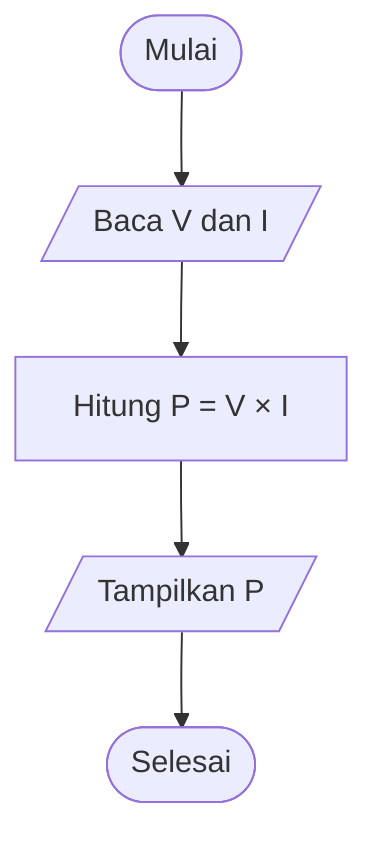
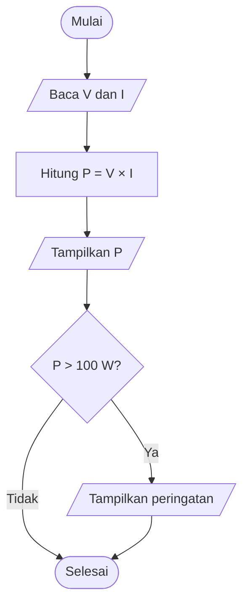

# Solusi Latihan Kuliah 2: Berpikir Algoritmik dan Perancangan Algoritma

Solusi ini mengikuti bagian **Latihan** pada [catatan kuliah pertemuan kedua](https://github.com/artnugraha/algoritma-pemrograman/blob/main/Catatan-Kuliah/pertemuan-02.md#latihan). Setiap pernyataan soal ditulis kembali sebelum pembahasannya.

## 1. Perumusan algoritma dari suatu masalah fisika

### Soal

Sebuah sensor tekanan menghasilkan satu nilai tekanan $P$ dalam satuan pascal. Tuliskan spesifikasi masalah untuk mengubah tekanan tersebut menjadi kilopascal menggunakan
```math
P_{\text{kPa}}
=
\frac{P_{\text{Pa}}}{1000}.
```

Tentukan
- masukan;
- keluaran;
- langkah algoritma;
- prakondisi yang masuk akal.

Tuliskan algoritma dengan kalimat berurutan.

### Solusi

**Spesifikasi masalah.** Masukan berupa satu nilai tekanan $P_{\text{Pa}}$ dalam pascal. Keluaran berupa nilai tekanan yang sama, $P_{\text{kPa}}$, dalam kilopascal. Aturan konversinya adalah

```math
P_{\text{kPa}}=\frac{P_{\text{Pa}}}{1000}.
```

Prakondisi yang masuk akal ialah nilai tekanan tersedia sebagai bilangan hingga dan satuannya benar-benar pascal. Jika sensor mengukur tekanan absolut, kita juga dapat mensyaratkan $P_{\text{Pa}}\geq 0$; tekanan ukur relatif terhadap lingkungan dapat bernilai negatif sehingga syarat tambahan tersebut harus disesuaikan dengan jenis sensor.

Algoritma dengan kalimat berurutan:

```text
Baca tekanan P_Pa dalam pascal
Hitung P_kPa = P_Pa / 1000
Tampilkan P_kPa dalam kilopascal
```

Sebagai pemeriksaan, masukan $P_{\text{Pa}}=101325\ \text{Pa}$ menghasilkan $P_{\text{kPa}}=101.325\ \text{kPa}$. Nilainya masuk akal karena satu kilopascal sama dengan seribu pascal.

## 2. Diagram alir

### Soal

Buat diagram alir untuk menghitung daya listrik menggunakan
```math
P=VI.
```
Masukannya adalah $V$ dan $I$, sedangkan keluarannya adalah $P$. Kemudian, perluas diagram tersebut sehingga program juga menampilkan peringatan jika
```math
P>100\text{ W}.
```

### Solusi

Diagram pertama hanya menghitung dan menampilkan daya. Jajar genjang dipakai untuk masukan dan keluaran, sedangkan persegi panjang dipakai untuk perhitungan.



Pada diagram yang diperluas, daya dihitung lebih dahulu agar kondisi keputusan dapat diuji. Peringatan hanya ditampilkan ketika $P>100\ \text{W}$, sehingga $P=100\ \text{W}$ tidak memunculkan peringatan.



Kedua jalur menampilkan $P$, dan hanya jalur **Ya** menampilkan peringatan. Diagram ini mengikuti urutan masukan, proses, keluaran, lalu pemeriksaan ambang yang ditetapkan pada soal.

## 3. Pseudocode gerak lurus

### Soal

Sebuah benda bergerak dengan persamaan
```math
x(t)
=
x_0+v_0t+\frac12at^2.
```
Tuliskan *pseudocode* untuk menghitung
- posisi $x(t)$;
- kecepatan $v(t)=v_0+at$

Masukannya adalah
```math
x_0,\quad v_0,\quad a,\quad t.
```

### Solusi

Posisi dan kecepatan diperoleh dari masukan yang sama. Perhitungan $t^2$ ditulis sebagai perkalian `t*t` agar langkahnya mudah diterjemahkan ke C.

```text
ALGORITHM PositionAndVelocity

INPUT:
    x0
    v0
    a
    t

PROCESS:
    x ← x0 + v0*t + 0.5*a*t*t
    v ← v0 + a*t

OUTPUT:
    x
    v
```

Keluaran $x$ mempunyai satuan panjang, sedangkan $v$ mempunyai satuan panjang per waktu jika seluruh masukan memakai satuan yang konsisten. Algoritma ini menggunakan percepatan konstan sebagaimana diasumsikan oleh kedua persamaan gerak.

## 4. Tracing

### Soal

Gunakan algoritma statistik berikut.
```text
sum ← x1
minimum ← x1
maximum ← x1

FOR i ← 2 TO N
    sum ← sum + xi

    IF xi < minimum
        minimum ← xi
    END IF

    IF xi > maximum
        maximum ← xi
    END IF
END FOR
```
Lakukan tracing untuk data
```math
4.2,\quad3.8,\quad5.1,\quad2.9,\quad4.7.
```

Buat tabel yang memuat
- indeks;
- data;
- `sum`;
- `minimum`;
- `maximum`.

### Solusi

Nilai $N=5$, sehingga data pertama dipakai untuk mengisi keadaan awal. Pada setiap baris berikutnya, `sum` diperbarui dan nilai data dibandingkan dengan minimum serta maksimum saat itu.

| Indeks $i$ | Data $x_i$ | `sum` | `minimum` | `maximum` |
|---:|---:|---:|---:|---:|
| 1 (inisialisasi) | 4.2 | 4.2 | 4.2 | 4.2 |
| 2 | 3.8 | 8.0 | 3.8 | 4.2 |
| 3 | 5.1 | 13.1 | 3.8 | 5.1 |
| 4 | 2.9 | 16.0 | 2.9 | 5.1 |
| 5 | 4.7 | 20.7 | 2.9 | 5.1 |

Sebagai contoh, pada indeks 4, jumlah berubah dari $13.1$ menjadi $13.1+2.9=16.0$, sedangkan minimum berubah dari $3.8$ menjadi $2.9$. Hasil akhir penjejakan adalah `sum = 20.7`, `minimum = 2.9`, dan `maximum = 5.1`.

## 5. Mencari kesalahan algoritma

### Soal

Perhatikan algoritma berikut.
```text
minimum ← 0

FOR i ← 1 TO N
    IF xi < minimum
        minimum ← xi
    END IF
END FOR
```
Apakah algoritma tersebut **selalu** benar?

Ujilah menggunakan data
```math
2,\quad5,\quad1,\quad4.
```
Kemudian, uji menggunakan
```math
2,\quad5,\quad1,\quad4,\quad8.
```
Jelaskan mengapa hasil tertentu dapat menipu kita seolah-olah algoritma sudah benar. Perbaiki algoritma tersebut.

### Solusi

Algoritma tersebut **tidak selalu benar** karena nilai awal `minimum = 0` tidak berasal dari data. Untuk kedua masukan dalam soal, setiap data positif, sehingga syarat `xi < minimum` selalu salah dan nilai minimum tetap nol.

| Masukan | Jejak `minimum` setelah setiap data | Hasil algoritma | Minimum sebenarnya |
|---|---|---:|---:|
| $2,5,1,4$ | $0,0,0,0$ | 0 | 1 |
| $2,5,1,4,8$ | $0,0,0,0,0$ | 0 | 1 |

Kedua data uji yang diminta justru langsung menunjukkan kesalahan. Hasil yang dapat menipu muncul jika data memuat bilangan negatif, misalnya $(-3,2,5)$: algoritma menghasilkan $-3$, yang kebetulan memang minimum. Hasil benar pada satu contoh tidak membuktikan bahwa algoritma bekerja untuk semua masukan.

Perbaikan berikut memakai data pertama sebagai nilai awal. Prakondisinya $N>0$, dan pengulangan dimulai dari indeks 2 agar setiap data diproses tepat satu kali.

```text
ALGORITHM Minimum

INPUT:
    N
    x1, x2, ..., xN

PRECONDITION:
    N > 0

PROCESS:
    minimum ← x1

    FOR i ← 2 TO N
        IF xi < minimum
            minimum ← xi
        END IF
    END FOR

OUTPUT:
    minimum
```

Setelah setiap langkah, `minimum` adalah nilai terkecil di antara data yang telah dibaca. Sifat ini berlaku juga jika seluruh data positif, seluruh data negatif, atau data memuat nol.

## 6. Kompleksitas

### Soal

Tentukan kompleksitas waktu secara intuitif untuk algoritma berikut.

**Algoritma A**

```text
y ← a*x + b
```

**Algoritma B**

```text
sum ← 0

FOR i ← 1 TO N
    sum ← sum + xi
END FOR
```

**Algoritma C**

```text
FOR i ← 1 TO N
    FOR j ← 1 TO N
        print(i, j)
    END FOR
END FOR
```

Pilih dari
```math
O(1),
```
```math
O(N),
```
atau
```math
O(N^2).
```
Jelaskan alasan setiap jawaban.

### Solusi

Jumlah langkah yang dilakukan oleh setiap algoritma menentukan pola pertumbuhan waktunya. Pada analisis ini, satu operasi dasar dipandang memerlukan waktu terbatas yang tidak bergantung pada $N$.

| Algoritma | Banyaknya langkah yang bertumbuh terhadap $N$ | Kompleksitas waktu |
|---|---|---|
| A | Satu perkalian, satu penjumlahan, dan satu pemberian nilai | $O(1)$ |
| B | Tubuh pengulangan dijalankan $N$ kali | $O(N)$ |
| C | Untuk setiap $N$ nilai $i$, terdapat $N$ nilai $j$, sehingga `print` dijalankan $N^2$ kali | $O(N^2)$ |

Algoritma A melakukan jumlah pekerjaan yang tetap meskipun nilai $x$ berubah. Algoritma B mengunjungi setiap data sekali, sedangkan Algoritma C mengunjungi $N\times N$ pasangan indeks.

## 7. Perbandingan pertumbuhan

### Soal

Hitung nilai $N$ dan $N^2$ untuk
```math
N=10,
```
```math
N=100,
```
```math
N=1000,
```
dan
```math
N=10000.
```
Jelaskan mengapa algoritma $O(N^2)$ dapat menjadi masalah untuk data besar.

### Solusi

Nilai yang diminta diperoleh dengan mengalikan $N$ dengan dirinya sendiri. Tabel berikut memperlihatkan pertumbuhan kedua besaran.

| $N$ | $N^2$ |
|---:|---:|
| 10 | 100 |
| 100 | 10.000 |
| 1.000 | 1.000.000 |
| 10.000 | 100.000.000 |

Ketika $N$ naik sepuluh kali, besaran $N^2$ naik seratus kali. Untuk $N=10.000$, algoritma yang menjalankan operasi pada setiap pasangan indeks dapat memerlukan sekitar seratus juta operasi pada bagian tersebut; inilah sebabnya pertumbuhan kuadratik dapat memberatkan pemrosesan data besar. Notasi $O(N^2)$ menyatakan pola pertumbuhan, bukan jumlah detik yang pasti.

## 8. Studi kasus temperatur

### Soal

Gunakan data
```math
T=
\{27.5,\ 31.2,\ 29.0,\ 32.8,\ 30.1,\ 28.4\}
```
dengan batas
```math
T_{\text{limit}}
=
30^\circ\text{C}.
```

Secara manual tentukan
- rata-rata;
- minimum;
- maksimum;
- banyak data yang lebih besar daripada batas.

Kemudian, lakukan tracing algoritma `TemperatureMonitoring` yang dibahas pada catatan kuliah.

### Solusi

Jumlah keenam data adalah

```math
27.5+31.2+29.0+32.8+30.1+28.4=179.0.
```

Karena $N=6$, rata-rata dan nilai ekstremnya adalah

```math
\overline{T}=\frac{179.0}{6}=29.8333\ldots\,^\circ\text{C},
\qquad
T_{\min}=27.5\,^\circ\text{C},
\qquad
T_{\max}=32.8\,^\circ\text{C}.
```

Data yang **lebih besar** daripada $30\,^\circ\text{C}$ adalah $31.2$, $32.8$, dan $30.1\,^\circ\text{C}$. Jadi, `count_high = 3`; nilai yang persis sama dengan batas tidak akan dihitung karena syaratnya adalah `Ti > T_limit`.

Algoritma `TemperatureMonitoring` menginisialisasi jumlah, minimum, dan maksimum dari $T_1$, lalu memproses data berikutnya satu per satu. Berikut keadaan setelah setiap data selesai diproses.

| Indeks $i$ | $T_i$ ($^\circ\text{C}$) | `sum` | `minimum` | `maximum` | `count_high` |
|---:|---:|---:|---:|---:|---:|
| 1 (inisialisasi) | 27.5 | 27.5 | 27.5 | 27.5 | 0 |
| 2 | 31.2 | 58.7 | 27.5 | 31.2 | 1 |
| 3 | 29.0 | 87.7 | 27.5 | 31.2 | 1 |
| 4 | 32.8 | 120.5 | 27.5 | 32.8 | 2 |
| 5 | 30.1 | 150.6 | 27.5 | 32.8 | 3 |
| 6 | 28.4 | 179.0 | 27.5 | 32.8 | 3 |

Pada akhir penjejakan, algoritma menghitung `mean = sum / N = 179.0 / 6`. Hasilnya sama dengan perhitungan manual: rata-rata sekitar $29.83\,^\circ\text{C}$, minimum $27.5\,^\circ\text{C}$, maksimum $32.8\,^\circ\text{C}$, dan tiga pengukuran di atas batas.
